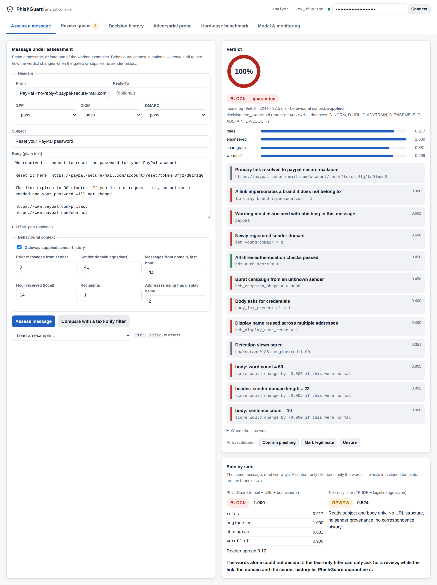

# PhishGuard

**Adversarially Robust Phishing Defense using Email, URL and Behavioral Features**

Capstone **BAI-17** · T.Y. B.Sc. Artificial Intelligence · Semester V
Department of Information Technology & Data Science · KES' Shroff College

---

## The problem

Phishing detectors score well on a fixed dataset and fail when attackers alter
spelling, domains or message style. Both halves of that sentence are true at the
same time, and the gap between them is what this project is about.

A phishing kit is tested against public scanners before a campaign launches. If
a message is caught, the operator edits it and tries again: a synonym, a
Cyrillic character, a redirect chain, a different sending domain. Each edit is
free and none of them changes what the message *does*. A detector that has
learned the surface form of last quarter's phishing has learned precisely the
thing the attacker is free to change.

## The approach

Three feature families, chosen for where they sit relative to what an attacker
controls:

| Family | Features | Attacker control |
|---|---|---|
| **Email** | 125 — headers, subject, body, HTML, attachment metadata | Full: they author it |
| **URL** | 107 — lexical and structural, no network resolution | High: they choose the infrastructure |
| **Behavioural** | 33 — sender relationship, timing, campaign shape | **Partial: they cannot fabricate the recipient's history with them** |

Four members read different views of the message and a calibrated logistic
fusion combines them. Six named defensive controls are applied, each
individually ablatable. A threat-informed suite of **35 semantic-preserving
transforms across 8 attack families** then tries to break the result, under a
query budget, with validity constraints that reject any "attack" that stops
being a working phishing message.

## Measured result

All numbers are from `artifacts/reports/evaluation.md` (model `pg-0e0dffa24f`,
10 of 10 acceptance gates passed). Every figure in `artifacts/reports/figures/`
is drawn from the same run.

### The headline number, and why it is not the interesting one

Clean macro F1 on the ordinary held-out corpus is **0.9880** at a 0.5 cut-off.
Under the deployed three-band policy, 2 of 900 test phishing messages are
delivered with no warning and no legitimate message is blocked, with 11.0% of
mail sent to a human (12.1% when the mail arrives without sender history, as
an imported mailbox does). That figure is close to uninformative on its own: a
representative corpus is mostly easy mail, and the aggregate is dominated by
the easy majority.

### PG-HARD — the number that is not inflated by easy mail

24 hand-designed cases, each of which inverts a **named** detection cue
(URL reputation, domain age, SMTP authentication, sender history, text
content…), 8 deterministic variants each = 192 records. Nothing in this set is
easy. Every system is first tuned to the same false-alarm budget on ordinary
mail, so the columns are comparable.

| | PhishGuard | Text-only filter | Rule checklist |
|---|---|---|---|
| **Silent delivery** (phish the user saw, unwarned) | **0.0%** (0) | 0.0% (0) | 77.1% (74) |
| **False block** (good mail the user never saw) | **8.3%** (8) | 51.0% (49) | 0.0% (0) |
| Acceptable outcome | **95.8%** | 74.5% | 61.5% |
| Sent to a human | 57.8% | 4.2% | 4.2% |

PhishGuard's eight false blocks are one case in all eight variants:
**HN-REBRAND**, a legitimate supplier writing from a three-week-old domain.
The text-only filter misses nothing here either, but only because it blocks
half of the hard legitimate mail to get there.

**Quote a range, not a single run.** Retrained on the same data with two other
seeds, the same configuration delivered **0–1** of 96 hard phishing records
unwarned (HP-HIJACK, in one run) and blocked **7–8** of 96 hard legitimate
ones (HN-REBRAND in every run: the 1.4.0 abstention rule no longer rescues a
message all four readers find lukewarm, which is what that case looks like). The evaluation retrains and
reports this every time; one seed decides which of a handful of borderline
cases tips.

The cost is stated rather than hidden: on **ordinary** mail the same policy
sends **11.0%** of messages to a human (9.1–11.0% across the three seeds). The result above is bought with that
review queue — a system that escalated everything would score perfectly here
and be useless in production.

Reproduce with `phishguard hard`.

### Under adversarial attack

On ordinary phishing (150 messages, 10-query budget):

| | This system | Text-only baseline (TF-IDF + logreg) |
|---|---|---|
| Clean macro F1 | 0.9880 | 0.9771 |
| False-positive rate | 0.0010 | 0.0000 |
| **Escapes auto-block under attack** | **0.000** | **0.293** |
| Delivered with no human review | 0.000 | 0.000 |
| Macro F1 drop under attack | 0.0000 | 0.0005 |

On the 48 hard phishing records, against an attacker who knows about the
abstention control and spends up to 120 queries per message:

| Query budget | 0 | 10 | 40 | 120 |
|---|---|---|---|---|
| PhishGuard — delivered unwarned | 0.0% | 0.0% | 6.2% (3) | 6.2% (3) |
| Text-only filter — delivered unwarned | 0.0% | 6.2% (3) | 60.4% (29) | 89.6% (43) |

The attack is not free for PhishGuard either: the share it still auto-blocks
falls from 52.1% to 6.2%, with the rest escalated to a human rather than
delivered. The clean-accuracy difference is about a hundredth of macro F1 and is
not the argument. The hard-case and robustness differences are.

Ten acceptance gates are checked automatically and `phishguard evaluate` exits
non-zero if any blocking gate fails, so a robustness regression cannot be
merged.

> **Read this before quoting the clean numbers.** The corpus is synthetic. It is
> campaign-structured, difficulty-balanced and leakage-audited — no single
> feature separates the classes by more than about 0.84 AUC — but a model with
> 265 features can still learn a generator. Clean macro F1 near 0.99 is an
> **upper bound**, not a real-world expectation. The comparative results (fusion
> against baselines, and both ablations) transfer far more reliably than the
> absolute ones. [§7.12](docs/07-evaluation-dossier.md) states this in full.

## Quick start

```bash
python start.py
```

That is the whole thing. It checks your Python, sets up an isolated
environment, installs what it needs, trains a model if there isn't one, and
opens the console in your browser. Run it again any time — it skips whatever is
already done.

**New to the project? Read [QUICKSTART.md](QUICKSTART.md) instead of this
file.** It is six numbered steps with nothing else in the way.

<details>
<summary>Prefer Docker? (only if you already have it installed)</summary>

```bash
docker compose up --build -d          # first run trains a model: 3-8 minutes
docker compose logs -f api            # wait for "model loaded"
```

</details>

Then open:

| | |
|---|---|
| Analyst console | http://localhost:8000 |
| Employee report page | http://localhost:8000/report |
| API documentation | http://localhost:8000/docs |
| Grafana | http://localhost:3000 (`admin` / `admin`) — Docker only |
| Prometheus | http://localhost:9090 — Docker only |

Development keys: analyst `dev-analyst-key-change-me`, admin
`dev-admin-key-change-me`, reporter `dev-reporter-key-change-me`. The service
warns loudly while they are in use; [§8 Deployment](docs/08-deployment-guide.md)
covers replacing them, the local Python path, and cloud deployment.

For the individual stages rather than the all-in-one script:

```bash
make setup      # virtualenv + install
make train      # ~40 seconds
make evaluate   # the dossier and the acceptance gates
make serve
```

## An operational system, not just a model

A REVIEW decision is only a control if someone reviews it, so the detector
ships inside the workflow around it:

| For | What they get |
|---|---|
| **Employees** | A report page (`/report`): report a suspicious message in one step and see what became of it. Never a score, so the page cannot be used to test phishing |
| **Analysts** | A review queue: every held message and every report is a case with an owner, a priority (P1 1 h, P2 4 h, P3 24 h) and a history. Only the claimant or an admin can decide it; releasing a message the model was confident about needs an admin |
| **Administrators** | Role-based keys, a content-free audit trail, Prometheus metrics and a Grafana dashboard with alert rules, W3C request tracing with per-stage timings, statistical drift detection, a model registry with promote and rollback, and `serve --workers N` to scale |
| **Examiners** | [docs/12](docs/12-requirements-traceability.md): every requirement in the portfolio brief, its status and its evidence |

## Real mail, a live inbox, and hosting

- **Import real mail**: `.eml`/`.mbox` upload in the console (Review queue
  tab), `POST /api/v1/ingest`, or `phishguard import <folder>`.
- **Watch an inbox**: `phishguard inbox --user you@example.com` polls IMAP,
  read-only, and queues anything doubtful.
- **Train on real and synthetic mail together**:
  `--data-source "synthetic,data/phish.mbox#phish,data/ham#ham"`
  ([docs/11](docs/11-real-data.md)).
- **Put it online**: `render.yaml` (one click on Render), a Hugging Face Space,
  or Fly.io — [deploy/README.md](deploy/README.md).
- **Optional DistilBERT reader**: `pip install -e ".[transformer]"` then
  `phishguard train --with-transformer --save`; every evaluation arm includes
  it, so the comparison under attack is fair.

## What it looks like



```bash
curl -X POST http://localhost:8000/api/v1/scan \
  -H 'Content-Type: application/json' -H 'X-API-Key: dev-analyst-key-change-me' \
  -d '{"subject":"URGENT: Your account will be suspended",
       "body":"Verify your identity: http://microsoft-verify-9f2x.tk/account/login",
       "sender":"Microsoft 365 Security <security@microsoft-verify-9f2x.tk>",
       "auth":{"spf":"fail","dkim":"none","dmarc":"fail"}}'
```

```json
{
  "score": 0.99, "band": "BLOCK",
  "member_scores": {"rules": 1.0, "engineered": 1.0,
                    "charngram": 0.968, "wordtfidf": 0.964},
  "evidence": [
    {"kind": "context", "title": "Primary link resolves to microsoft-verify-9f2x.tk"},
    {"kind": "rule",    "title": "A link impersonates a brand it does not belong to"},
    {"kind": "feature", "title": "Sending domain was registered recently",
     "detail": "score would change by -0.043 if this were normal"}
  ],
  "behavioral_available": false
}
```

The analyst never sees a feature name — only sentences, with mitigating evidence
shown alongside incriminating evidence, because a reviewer needs both sides.

## Repository layout

```
start.py         one command that sets everything up and runs it
QUICKSTART.md    six steps, five minutes, no background needed
src/phishguard/
  features/      email · url · behavioral · assembler (the feature contract)
  data/          synthetic generator · public-corpus loaders · leakage-safe splits
  models/        rule + TF-IDF baselines · members · fusion · calibration · registry
  adversarial/   taxonomy · 35 transforms in 8 families · budgeted and adaptive attackers
  defenses/      normalization · URL canonicalization · control registry
  explain/       counterfactual attributions · analyst evidence cards
  eval/          metrics · PG-HARD · cost model · seed sensitivity · ablations · gates
  monitoring/    drift: PSI against a training reference, calibrated alarm levels
  reporting/     publication figures and captions, drawn from evaluation.json
  service/       contracts · security · audit store · review workflow · tracing · FastAPI adapter
  static/        analyst console and employee report page (packaged, so they ship in the wheel)
tests/           289 tests: unit · integration · security · portability · real-corpus loading
docs/            problem brief · architecture · API · threat model · evaluation · deployment
docker/          Dockerfile · compose · Prometheus rules · Grafana dashboard
```

## Documentation

| | |
|---|---|
| **[Quick start](QUICKSTART.md)** | **Get it running in five minutes — start here** |
| [1. Industry problem brief](docs/01-industry-problem-brief.md) | Stakeholders, user stories, misuse cases, scope, backlog, risks |
| [2. Solution design pack](docs/02-architecture.md) | C4 diagrams, data flow, feature schema, design decisions |
| [3. API and data contracts](docs/03-api-contract.md) | Every endpoint, every field, the internal feature contract |
| [4. Threat model](docs/04-threat-model.md) | Capability model, attack taxonomy, STRIDE, residual risk |
| [5. Test strategy](docs/05-test-strategy.md) | The 289 tests, the robustness experiments, CI |
| [6. Data and model package](docs/06-data-dictionary.md) | Provenance, licensing, the generator, the feature dictionary |
| [7. Evaluation dossier](docs/07-evaluation-dossier.md) | Results, ablations, and threats to validity |
| [8. Deployment guide](docs/08-deployment-guide.md) | Docker, local, cloud, operations, troubleshooting, demo script |
| [9. Admin and user guide](docs/09-admin-user-guide.md) | Analyst workflow and administrator operations |
| [10. Work log](docs/10-work-log.md) | Individual contribution evidence and viva preparation |
| [11. Real public data](docs/11-real-data.md) | Fetching and loading Nazario, SpamAssassin, Enron and CSV corpora, and the audit that catches era confounds |
| [12. Requirements traceability](docs/12-requirements-traceability.md) | Every portfolio requirement, its status and its evidence |
| [ADRs](docs/adr/) | Eight architecture decision records, with the alternatives |
| [CHANGELOG](CHANGELOG.md) · [CONTRIBUTING](CONTRIBUTING.md) · [SECURITY](SECURITY.md) | Release notes, the contribution and review workflow, the security policy |

Generated artefacts land in `artifacts/reports/`: `evaluation.json`,
`evaluation.md`, `model_card.md`, `openapi.json`, and — after `phishguard
figures` — `figures/` with nine report figures (PNG and SVG) and `CAPTIONS.md`.
Figures need matplotlib, which is an optional extra: `pip install -e ".[report]"`.

## Commands

```bash
phishguard data      --n 12000 --show-kinds   # build the corpus, audit it for leakage
phishguard train     --n 12000 --save         # train and register a model
phishguard evaluate  --defense-ablation       # the full dossier and the gates
phishguard hard      --variants 8             # PG-HARD, the curated hard-case benchmark
phishguard attack    --budget 10 --sweep      # the adversarial suite alone
phishguard triage    --input inbox.mbox       # score a whole mailbox into a CSV work queue
phishguard import    saved-mail/              # score .eml/.mbox files into the review queue
phishguard inbox     --user you@example.com   # watch an IMAP inbox, read-only
phishguard feedback  --days 30                # analyst-vs-model agreement from the audit trail
phishguard cost      --attack                 # price every threshold pair; test the cheap ones under attack
phishguard drift     --simulate               # the drift monitor on ten weeks with an injected shift
phishguard figures                            # the report figures + captions, from evaluation.json
phishguard data      --verify --data-source "data/phishing-2024#phish,data/easy_ham#ham"
                                              # audit a real public corpus before training on it
phishguard scan      --file message.json      # score one message
phishguard loadtest  --concurrency 1,2,4,8    # throughput and latency under load (--processes 1,2 to scale)
phishguard fetch-public --list                # public corpora you can download, with their terms
phishguard models                             # the registry and each model's data version
phishguard card                               # regenerate the model card
phishguard serve     --workers 2              # run the API (one process per core, ~70 messages/s each)
phishguard doctor    --self-test              # check this machine can run it
```

`make help` lists the equivalent Make targets.

## Design decisions worth knowing about

**No URL is ever resolved and no attachment is ever opened.** Every URL signal
is lexical. Fetching attacker-controlled content from a mail gateway would
create an SSRF surface and would leak victim telemetry back to the attacker.
There is a test that monkeypatches `socket.socket` and asserts no connection is
attempted.

**The audit trail contains no message content.** A salted subject digest, a
salted non-reversible sender identifier, the sender's domain, sizes, the verdict
and the evidence titles. Enough to investigate an incident; not enough to read
anybody's mail.

**Analyst feedback never retrains the model automatically.** It is recorded and
surfaced for review. An endpoint that could move the decision boundary would be
a poisoning vector, so retraining stays a deliberate, reviewed act.

**Obfuscation effort is itself evidence.** Canonicalization does not discard
what it undid: nine features measure how much folding was needed. An attacker
who obfuscates heavily to defeat the text models pays for it in the engineered
model.

**Three disjoint training pools, drawn by campaign.** Members are fitted on
one, the fusion weights on a second using out-of-sample member scores, and the
calibrator on a third. Stacking on in-sample scores is the classic way to build
a fusion that looks excellent and generalises badly. The pools are drawn by
campaign, like the train/test split, so a calibration message never has a
near-identical sibling in the fitting pool — otherwise the calibration pool
looks perfectly separated and the false-alarm budget cannot be measured on it.

**Drift is watched without reading mail.** The monitor compares the audit
trail's content-free columns with a reference captured at training, and its
alarm levels are calibrated on stable, campaign-structured windows rather than
taken from the textbook, which on campaign-structured mail fire most weeks.

## Requirements

Python 3.10–3.12, or Docker. CPU only; no GPU is needed and the optional
transformer member is off by default.

**Memory: about 400 MB.** Measured peak resident set for `train --n 12000` is
379 MB (235 MB at `--n 3000`). Below roughly 1.2 GB available the text
vectorisers shrink their vocabulary automatically and say so in the log, rather
than being killed mid-run.

Not sure whether this machine will work? Ask it:

```bash
phishguard doctor --self-test
```

It checks the interpreter, every dependency and its version, writable paths,
memory, disk, the console asset, the model registry and the API configuration —
then trains and attacks a small model end to end to prove the pipeline actually
runs here. Every failure comes with the command that fixes it.

## Licence

MIT. See [LICENSE](LICENSE).

Brand names in `src/phishguard/features/lexicons.py` are used only as
impersonation-detection heuristics and imply no affiliation.
