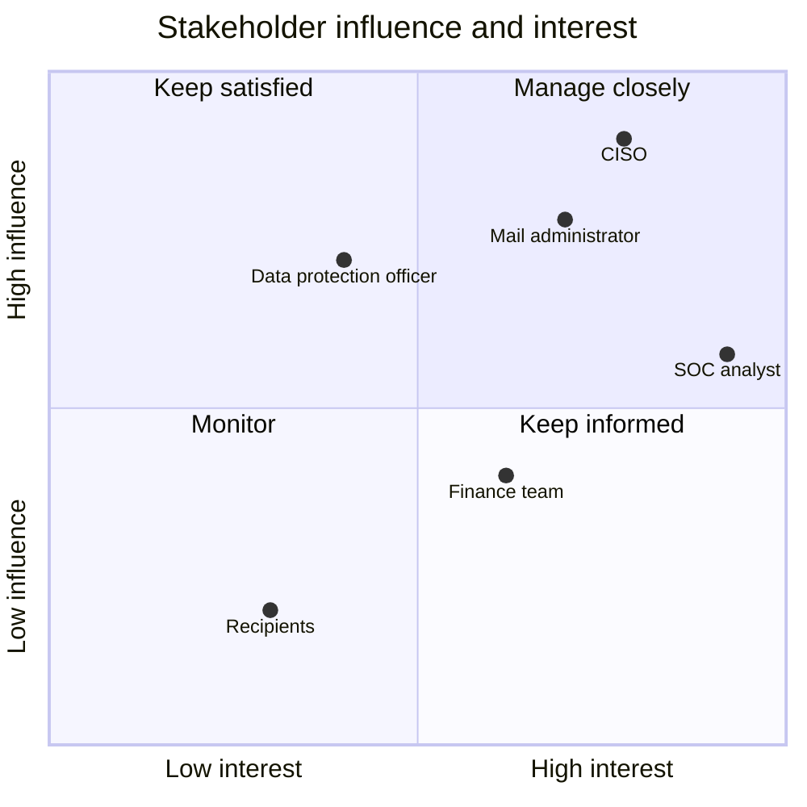
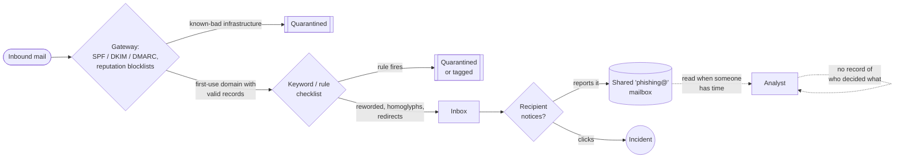

# 1. Industry problem brief

**BAI-17 — Adversarially Robust Phishing Defense using Email, URL and Behavioral Features**
T.Y. B.Sc. Artificial Intelligence · KES' Shroff College · Semester V

| Section | Contents |
|---|---|
| [1.1](#11-the-problem-stated-precisely) | The problem, stated precisely |
| [1.2](#12-stakeholder-map) | Stakeholder map |
| [1.3](#13-personas) | Personas |
| [1.4](#14-current-process-and-its-evidence) | Current process and its evidence |
| [1.5](#15-user-stories-with-acceptance-criteria) | User stories, with acceptance criteria |
| [1.6](#16-misuse-and-abuse-cases) | Misuse and abuse cases |
| [1.7](#17-scope) | Scope and exclusions |
| [1.8](#18-success-metrics) | Success metrics and non-functional requirements |
| [1.9](#19-prioritised-backlog) | Prioritised backlog |
| [1.10](#110-risks) | Risks |

---

## 1.1 The problem, stated precisely

Phishing detectors perform well on a fixed dataset and fail when attackers alter
spelling, domains, or message style.

That sentence is the whole brief, and the important word in it is *fixed*. A
model fitted on last quarter's corpus is being asked to classify messages that
were written **after** it was trained, by someone who can see whether their
message got through. The literature reports macro F1 above 0.98 on public
corpora routinely; operational filters are bypassed daily. Both facts are true,
and the gap between them is the subject of this project.

The gap has a specific shape. A phishing kit is tested against public scanners
before a campaign launches. If the message is caught, the operator edits it and
tries again: a synonym here, a Cyrillic character there, a redirect chain, a
different sending domain. Each edit costs the attacker almost nothing and none
of them changes what the message *does*. A detector that has learned the surface
form of last quarter's phishing has learned exactly the thing the attacker is
free to change.

## 1.2 Stakeholder map

| Stakeholder | What they need | What failure costs them |
|---|---|---|
| **Recipient** (any employee) | Not to be asked to be an expert. Clear signal when a message is dangerous, and a one-click way to report one | Credential loss, financial loss, and the blame that follows |
| **Security analyst** (SOC) | Triage that is worth reading: a high-signal queue, evidence they can act on, no wall of false alarms | Alert fatigue; the queue stops being read, which removes the last human control |
| **Mail administrator** | An inline filter that does not delay mail and does not quarantine the invoice the finance team is waiting for | A single high-profile false positive gets the filter switched off |
| **CISO / risk owner** | Defensible assurance: what is this thing's actual failure mode, and what covers it | Cannot answer an audit question, or discovers the answer during an incident |
| **Finance / AP team** | Protection specifically against invoice fraud and payment diversion, which is where the money goes | Direct financial loss, often irrecoverable |
| **Data protection officer** | Detection without building a searchable archive of employees' mail | A monitoring tool becomes the privacy incident |
| **Attacker** (adversarial stakeholder) | Cheap, repeatable evasion | — modelled explicitly in [§4 Threat model](04-threat-model.md) |

The adversary is listed as a stakeholder deliberately. A system whose
requirements document does not contain the attacker's goals will be evaluated
only against the cases its authors happened to think of.

**Influence and interest.** Where each stakeholder sits decides how they are
engaged: the risk owner and the administrator can switch the system off, so they
are managed closely; recipients are many and individually low-influence, so the
design has to serve them without asking anything of them.

## 1.3 Personas

Four people the system is built for, and one it is built against. They are
composites, written so that each design decision can be traced to someone who
needs it; the user stories in §1.5 are written in their voices.

### Meera — SOC analyst (L1)

> *"Give me the reason, not just the score. I have forty seconds per message."*

| | |
|---|---|
| **Context** | Works a shared queue in a 1,200-person logistics company; three analysts per shift |
| **Goals** | Clear the queue inside its service level; never be the person who released the phish |
| **Frustrations** | The last tool showed a score and nothing else; two analysts once worked the same message without knowing; the "why" had to be rebuilt from raw headers |
| **Uses in PhishGuard** | The review queue (claim, resolve, escalate), the evidence list, member scores, the timeline, feedback |
| **Success looks like** | Median time to decide under two minutes; no case breaches its SLA; her corrections are recorded and counted |

### Arjun — mail administrator

> *"The filter that quarantined payroll mail was switched off in a day. I am not going through that again."*

| | |
|---|---|
| **Context** | Runs the mail gateway and its integrations; answers to the IT head, not to security |
| **Goals** | No added mail latency; no false blocks on finance mail; one command to deploy and one to roll back |
| **Frustrations** | Vendors quote accuracy, never a false-positive rate at an operating point; retraining that changes behaviour silently |
| **Uses in PhishGuard** | Threshold tuning against a false-positive budget, the model registry and rollback, `/readyz`, Grafana, the load test |
| **Success looks like** | p95 assessment latency within the gateway's inline budget; false-positive rate within the agreed budget; every model change traceable |

### Kavita — CISO

> *"Tell me what gets through, how often, and what covers it."*

| | |
|---|---|
| **Context** | Reports cyber risk to the board and the auditors; signs the risk acceptance |
| **Goals** | A robustness claim she can re-run, not a slide; a written list of what the system does not do |
| **Frustrations** | "99.9% accurate" with no method, no data and no failure analysis |
| **Uses in PhishGuard** | The evaluation dossier and its acceptance gates, the residual-risk register, the model card, the go/no-go recommendation |
| **Success looks like** | Every number she quotes has a command that reproduces it |

### Rohan — accounts-payable executive (recipient and reporter)

> *"The fake invoice looked exactly like the real one. I only noticed because the bank details were new."*

| | |
|---|---|
| **Context** | Pays two hundred supplier invoices a week; the most-targeted role in the company |
| **Goals** | Pay the right supplier on time; report a strange message in one click without feeling foolish |
| **Frustrations** | Reporting used to go into a mailbox nobody answered; he never learned what happened |
| **Uses in PhishGuard** | The report page (`/report`) and "My reports", which tells him in plain words what became of each report |
| **Success looks like** | A status on every report within its service level, and never a machine telling him a held message is "fine" |

### The kit operator — adversarial persona

> *"Which is the cheapest edit that gets delivered?"*

| | |
|---|---|
| **Context** | Buys or rents a phishing kit; runs campaigns against many organisations at once |
| **Capabilities** | Black-box access to *some* filter's decisions; free to rewrite text, swap characters, register look-alike domains and add redirects. Cannot send from the genuine brand's domain (that is account compromise, `OOS-1`) |
| **Goals** | Delivery without review; minimum edits; reuse of what worked elsewhere |
| **What PhishGuard does about it** | Measures exactly this attacker ([§4](04-threat-model.md), [§7.4](07-evaluation-dossier.md)): budgeted, decision-based, semantic-preserving edits; defences that make the edits stop working; a REVIEW band that turns "nearly evaded" into "a person looks at it" |

## 1.4 Current process and its evidence

### The scale of the problem

Phishing remains the most frequently reported cybercrime and one of the most
expensive. The figures below are from the primary sources, quoted as published.

| Evidence | Figure | Source |
|---|---|---|
| Phishing/spoofing was the most-reported crime type to the FBI in 2025 | **191,561** complaints, of **1,008,597** in total; total reported losses **$20.877 billion** | FBI IC3, *2025 IC3 Annual Report* [R27] |
| Business email compromise — the payment-diversion fraud Rohan faces | **24,768** complaints and **$3.05 billion** in losses in 2025, the second-largest loss category | FBI IC3, *2025 IC3 Annual Report* [R27] |
| The human element in breaches | Present in **62%** of breaches; social engineering is the third most common breach pattern (**16%** of breaches); phishing is **16%** of initial access | Verizon, *2026 Data Breach Investigations Report* [R28] |
| Volume is still rising | Phishing attacks observed rose **10.1%** in one quarter, from 971,181 (Q1 2026) to **1,069,681** (Q2 2026) | APWG, *Phishing Activity Trends Report, Q2 2026* [R29] |
| Indian context | **22,68,346** cybercrime incidents registered on the National Cyber Crime Reporting Portal in 2024 (+42% on 2023); reported losses to cyber fraud **₹22,845.73 crore** in 2024 | Ministry of Home Affairs, Lok Sabha Unstarred Question No. 432, 2 Dec 2025 [R30] |

The Indian figures cover cybercrime and cyber fraud in general, not phishing
alone; no official phishing-only figure was found, and none is claimed. Full
references are in the final report's bibliography.

### The as-is process

The baseline this project must beat is not "nothing". In a typical organisation
it is three controls in sequence, each with a known blind spot:

1. **Reputation and authentication filtering** at the gateway (SPF/DKIM/DMARC,
   domain blocklists). Effective against bulk campaigns from known-bad
   infrastructure; blind to a first-use domain with correctly published records.
2. **A keyword and rule engine** — the analyst checklist. Implemented in this
   project as baseline **B0** (`src/phishguard/models/baseline.py`, 37 named
   rules) so that the comparison is a measurement, not an assertion.
3. **User reporting** — a "report phishing" button that forwards to a shared
   mailbox. High precision, arrives after delivery, depends on the recipient
   noticing — and in the as-is process has no queue, no owner, no service level
   and no answer back to the person who reported.

### The measured baseline

Measured on this project's held-out test set (1,938 messages, campaign-grouped
split, [§7](07-evaluation-dossier.md)):

| System | Macro F1 | False-positive rate | Phishing missed |
|---|---|---|---|
| **B0 — rule checklist** (the current process) | **0.895** | **5.5%** (57 of 1,038 legitimate) | 15.9% |
| B1 — TF-IDF + logistic regression (a conventional text model) | 0.977 | 0.0% | 4.9% |
| PhishGuard, fused score at a 0.5 cut-off | 0.988 | 0.1% (1 of 1,038) | 2.4% |

With its three-band policy instead of a single cut-off, PhishGuard delivers 2 of
the 900 test phishing messages without a warning and blocks no legitimate
message, at the price of sending 11.0% of mail to an analyst (12.1% when no
sender history is supplied, with 5 delivered unwarned).

That is the bar. A 5.5% false-positive rate means one legitimate message in
eighteen is quarantined — far past what a business tolerates, which is why the
checklist in practice runs in "tag only" mode and why "improve recall" is not by
itself a useful goal. The more important comparison is under attack, where the
text model is the one that fails ([§7.4](07-evaluation-dossier.md)).

### Pain points the design answers

| Pain point in the as-is process | Design response |
|---|---|
| A reworded message passes the checklist | Three independent feature families; semantic-preserving adversarial training; normalisation of homoglyphs and zero-width characters |
| A score without a reason cannot be triaged | Per-decision evidence in plain language, member scores, counterfactual attributions |
| Reports go to a mailbox nobody owns | A review queue with states, owners, priorities and service levels; the reporter sees what happened |
| Nobody can say who released a message, or why | Every transition is an audit event with actor, role, states and reason |
| A threshold is a guess | Thresholds chosen against a false-positive budget and priced with a cost model |
| "Is it still working?" has no answer | Drift monitoring, Prometheus metrics, per-stage traces, alert rules |

## 1.5 User stories, with acceptance criteria

Each story has an identifier used by the traceability matrix
([§12](12-requirements-traceability.md)) and by the backlog.

**Recipient and reporter (Rohan)**

| ID | Story | Acceptance criteria | Evidence |
|---|---|---|---|
| US-01 | As an employee, I want a dangerous message to be quarantined before I see it, so that I am not the last line of defence | Given a message scoring at or above the block threshold, the band is BLOCK and the decision is audited | `test_scan_records_a_decision_and_returns_a_band` |
| US-02 | As an employee, when a message is held, I want to know *why* in one sentence | The top evidence item is a readable sentence, not a feature name | `test_evidence_is_human_readable_not_feature_names` |
| US-03 | As an employee, I want to report a suspicious message in one step and learn what became of it | A report returns a case id and a plain-language status; "My reports" lists only my own reports; no score is ever shown to me | `test_a_user_report_is_queued_without_revealing_the_score`, `test_reporter_status_never_mentions_a_score` |

**Analyst (Meera)**

| ID | Story | Acceptance criteria | Evidence |
|---|---|---|---|
| US-04 | As an analyst, I want each queued message to arrive with the evidence that put it there | A case shows band, score, member scores, top evidence and the trace id; no message content | `test_verdict_carries_evidence_and_member_scores` |
| US-05 | As an analyst, I want to claim a case so that no colleague works it at the same time | A claimed case cannot be claimed, resolved or escalated by another analyst (403/409) | `test_a_second_analyst_cannot_steal_a_claimed_case`, `test_the_store_refuses_a_stale_transition` |
| US-06 | As an analyst, I want the most urgent case first | A user report on a message the model *allowed* is P1 (1 h); a held message is P2 (4 h); a report on blocked mail is P3 (24 h) | `test_priorities_follow_how_urgent_the_case_is`, `test_a_reported_message_the_model_allowed_jumps_the_queue` |
| US-07 | As an analyst, I want to record that the model was wrong, without that correction silently retraining the model | Resolving a case records feedback; nothing retrains automatically | `test_a_review_decision_opens_a_p2_case_and_resolution_records_feedback` |
| US-08 | As an analyst, I want to ask "would this get through if the attacker tried harder?" | The probe returns the edits tried, the score path and whether it evaded; admin-only | `test_adversarial_probe_runs_and_explains_itself` |

**Administrator (Arjun)**

| ID | Story | Acceptance criteria | Evidence |
|---|---|---|---|
| US-09 | As a mail administrator, I want to tune the block threshold against a false-positive budget | `phishguard cost` and the dossier report the operating point per budget; thresholds are configuration | [§7.7](07-evaluation-dossier.md), [§9.9](09-admin-user-guide.md) |
| US-10 | As a mail administrator, I want assessment to complete inline within the gateway's budget | p95 single-message latency ≤ 150 ms (gate G7); throughput under concurrency measured | Gate G7; `phishguard loadtest` |
| US-11 | As an administrator, I want to see where the time goes in a slow request | Each response carries `traceparent` and `Server-Timing`; per-stage histograms are exported | `test_one_trace_id_on_the_response_the_audit_record_and_the_stage_timings` |

**Risk owner (Kavita)**

| ID | Story | Acceptance criteria | Evidence |
|---|---|---|---|
| US-12 | As a CISO, I want a written statement of what this system does not defend against | Out-of-scope list and residual-risk register exist and are generated from measurements | [§4](04-threat-model.md), model card |
| US-13 | As a CISO, I want the robustness claim to be a measurement I can re-run | `phishguard evaluate` reproduces the dossier and exits non-zero if a gate fails | CI job "acceptance" |
| US-14 | As a CISO, I want a releasing decision on a high-risk message to need a second, more senior pair of eyes | Releasing a message scored at or above the block threshold needs the admin role | `test_releasing_a_message_the_model_would_block_needs_an_administrator` |

## 1.6 Misuse and abuse cases

Enumerated because the acceptance gates require it, and because several of them
changed the design.

| # | Misuse case | Design response |
|---|---|---|
| **M1** | Attacker queries the API repeatedly to tune a message until it passes | Rate limiting per key; every probe is audited; the adversarial-probe endpoint is admin-only so the *defender* has the capability and an anonymous caller does not |
| **M2** | Attacker submits a crafted message designed to crash or hang the scanner | Bounded input sizes, bounded batch sizes, no unbounded regex backtracking on attacker-controlled input, permissive parsers that never raise; tested in `tests/security/` |
| **M3** | Attacker poisons the model through the analyst feedback endpoint | Feedback is **recorded, never used to retrain automatically**. Retraining is a reviewed, manual act. Documented as `OOS-3` |
| **M4** | Insider uses the audit trail to read colleagues' mail | The audit trail stores no content: a salted subject digest, a pseudonymised sender, the domain, sizes and the verdict. There is nothing to read |
| **M5** | Attacker uses the scanner as an SSRF primitive or an oracle for victim activity by embedding internal URLs | The system **never resolves a URL or opens an attachment**. Every URL signal is lexical. Tested in `tests/security/test_security.py` |
| **M6** | The system is used to justify blocking mail from a competitor or a specific individual | Decisions are content-derived and auditable; the model card names "attributing an attack to a person or organisation" as out of scope |
| **M7** | An operator deploys with the development API keys | The service refuses to start in production without `PG_API_KEYS`, and logs a loud warning when development keys are in use |
| **M8** | A legitimate organisation is penalised because its domain resembles a brand | Named as a known harm in the model card and the responsible-AI review ([§7.16](07-evaluation-dossier.md)); the REVIEW band and the feedback loop are the mitigation; the brand lists are inspectable in one file |
| **M9** | A holder of a reporter key uses the report endpoint as a free scoring oracle | Reports return a case id and a plain-language status, **never a score or band**; the reporter role can reach nothing else |
| **M10** | An analyst releases a message the model was confident about, under pressure from a convincing "it's urgent, release it" request | Releasing a message scored at or above the block threshold requires the admin role and a written reason, recorded in the case history |
| **M11** | An analyst acts on a case another analyst owns — by mistake, or to hide a release | Object-level authorisation: only the assignee or an admin can release, resolve or escalate a claimed case; state changes are compare-and-set, so a stale write is refused |

## 1.7 Scope

**In scope**

- Inbound organisational email: headers, subject, plain-text body, HTML part,
  attachment *metadata*, and sender-relationship context from the gateway.
- A calibrated probability, a three-way decision, and analyst-readable evidence.
- Robustness against an attacker who rewrites the message they send.
- The human workflow around the decision: user reports, a review queue with
  owners and service levels, and an audit trail of every action.

**Explicitly out of scope** (with the reasoning, because an unstated exclusion
is a hidden assumption):

| Exclusion | Why |
|---|---|
| Attachment detonation and page fetching | Fetching attacker-controlled content from the gateway creates an SSRF surface and leaks victim telemetry to the attacker. Belongs in a dedicated sandbox downstream |
| Compromise of a genuine brand or partner domain | Mail genuinely sent from the real domain passes every header and reputation check by construction. This is an authentication problem (`OOS-1`) |
| Outbound mail and data-loss prevention | A different problem with different features |
| Non-email channels (SMS, voice, chat) | The behavioural family assumes a mail gateway. The 2026 DBIR notes that mobile-centric lures now out-perform email in simulations [R28]; that is a reason to scope carefully, not to stretch this model to channels it was not built for |
| Automated remediation | The system detects and explains; quarantine, notification and takedown are downstream |
| White-box gradient attacks | Assumes leaked model weights; the response to that is rotation, not a robustness claim (`OOS-2`) |
| Single sign-on for the console | API keys by role are sufficient for the MVP; an identity provider is the first production integration (§1.9, B30) |

## 1.8 Success metrics

Every one of these is checked automatically by `phishguard evaluate`, which
exits non-zero on failure. See [§7 Evaluation](07-evaluation-dossier.md).

| ID | Metric | Threshold | Why this number |
|---|---|---|---|
| G1 | Macro F1 | ≥ 0.90 | Weights both classes equally; a model cannot pass by ignoring one |
| G2 | PR-AUC | ≥ 0.93 | Threshold-free, and honest when the positive class is a minority of live traffic |
| G3 | False-positive rate | ≤ 0.02 | **The binding constraint.** Above this, the business switches the filter off |
| G4 | Expected calibration error | ≤ 0.08 | The thresholds are policy; the probabilities must mean what they say |
| G5 | Macro F1 drop under attack | ≤ 0.15 | The project's distinguishing requirement |
| G6 | Attack success (escapes auto-block) | ≤ 0.35 | Measured at the deployed operating point, not at 0.5 |
| G7 | p95 assessment latency | ≤ 150 ms | The gateway assesses inline; the tail is what causes backlog |
| G8 | Macro F1 advantage over B0 | ≥ 0.01 | The learned system must beat the checklist it replaces |
| G9 | Robustness advantage over B1 | ≥ 0 | The tri-modal design is justified by robustness, not clean accuracy |
| G10 | Leakage audit | must pass | Group overlap or a leaked feature invalidates every other number |

**Operational success metrics** — measured in production from the review queue
and the audit trail, not by the offline evaluation:

| Metric | Target | Where it is measured |
|---|---|---|
| Cases resolved within SLA | ≥ 95% | `GET /api/v1/cases/stats` → `resolved_within_sla` |
| Median time to claim a P1 case | ≤ 15 minutes | `median_seconds_to_claim` |
| Analyst disagreement with the model | tracked, alert on a sudden rise | `GET /api/v1/stats`, Grafana |
| User-report precision | tracked (a falling value means users need guidance, not the model) | `user_report_precision` |
| Review load | ≤ 20% of traffic at the chosen thresholds | `review_rate` in the dossier; the REVIEW share of `bands` in `/api/v1/stats` |

**Non-functional requirements**

| Requirement | Target | Verified by |
|---|---|---|
| Availability | Liveness independent of the model; `/readyz` reports *why* it is not ready | Integration tests; container smoke test in CI |
| Performance | p95 ≤ 150 ms single-message; throughput reported at 1, 4 and 8 concurrent callers | Gate G7; `phishguard loadtest` |
| Reproducibility | A fixed seed reproduces the corpus, the split and the metrics on any machine; data versions are content-addressed | Dataset fingerprint in the manifest and the dossier |
| Privacy | No message content in the database, logs or traces; audit retention bounded and swept | `test_audit_trail_stores_no_message_content`, `test_logs_never_carry_message_content`, `test_recent_traces_are_bounded_and_carry_no_message_content` |
| Portability | Clean machine to running system in one command, offline, no downloads | `python start.py`; `docker compose up --build` |
| Observability | Structured logs, Prometheus metrics, W3C trace context, per-stage latency, drift signal | [§9.12](09-admin-user-guide.md) |
| Security | Role-separated API keys, object-level authorisation, rate limits, bounded inputs, dependency and secret scanning in CI | `tests/security/`, CI job "security" |
| Auditability | Every decision and every queue transition is an audit record with actor, role and reason | `case_events` table; `test_every_action_state_pair_is_either_allowed_or_refused_explicitly` |

## 1.9 Prioritised backlog

Ordered by "what would this project be worthless without". Estimates are story
points (1 point ≈ 2 hours for one person). The same backlog is in
[`backlog.csv`](backlog.csv) for import into an issue tracker
(`scripts/bootstrap_github.py` creates the issues and milestones).

### Must have — delivered

| # | Item | Points | Where |
|---|---|---|---|
| B1 | Three independent feature families with clean interfaces | 8 | `features/` |
| B2 | Leakage-safe campaign-grouped splitting, with an audit that can fail the build | 5 | `data/splits.py` |
| B3 | Calibrated fusion over heterogeneous members | 8 | `models/detector.py` |
| B4 | Threat-informed attack taxonomy and a semantic-preserving transform suite | 8 | `adversarial/` |
| B5 | Named, individually ablatable defensive controls | 5 | `defenses/` |
| B6 | Baseline comparison (manual checklist and conventional text model) | 3 | `models/baseline.py` |
| B7 | Evaluation dossier with automated go/no-go gates | 5 | `eval/` |
| B8 | Serving API with authentication, audit trail and human oversight | 8 | `service/` |
| B9 | Analyst console with evidence and feedback | 5 | `static/index.html` |
| B10 | Containerised deployment, observability, CI | 5 | `docker/`, `.github/` |
| B11 | Model card, threat model, residual-risk register | 3 | `docs/`, generated |
| B20 | Review queue with case states, owners, priorities and SLAs | 8 | `service/workflow.py` |
| B21 | Reporter role and report page for email users | 3 | `static/report.html` |

### Should have — delivered

| # | Item | Points | Where |
|---|---|---|---|
| B12 | Modality ablation quantifying each family's contribution | 3 | `eval/run_eval.py` |
| B13 | Defence ablation quantifying each control's contribution | 3 | `eval/run_eval.py` |
| B14 | Per-decision counterfactual explanations | 5 | `explain/` |
| B15 | Adversarial probe endpoint for post-deployment assurance | 3 | `service/app.py` |
| B16 | Public-corpus loaders and fetcher with provenance and terms | 5 | `data/loaders.py`, `data/fetch.py` |
| B22 | Hard-case benchmark (PG-Hard) and expected-cost model | 5 | `data/hardcases.py`, `eval/hard_eval.py`, `eval/cost.py` |
| B23 | Request tracing (W3C trace context) with per-stage timings | 3 | `service/tracing.py` |
| B24 | Load test and resource measurements | 3 | `eval/loadtest.py` |
| B25 | Statistical drift detection with a calibrated false-alarm rate | 5 | `monitoring/drift.py` |
| B26 | Content-addressed dataset versions; optional MLflow tracking | 2 | `data/fingerprint.py`, `tracking.py` |

### Could have — designed for, not enabled by default

| # | Item | Status |
|---|---|---|
| B17 | Transformer member (DistilBERT) | Implemented and guarded behind an extra; off by default because it needs a GPU to be practical and the ablation shows what it would have to beat |
| B18 | Temporal-drift evaluation over a longer horizon | Temporal split implemented; a multi-quarter study needs real longitudinal data |
| B19 | Active learning from the analyst queue | Deliberately not built: it is the poisoning vector in `OOS-3` |
| B30 | Single sign-on (OIDC) for the console | Next production integration; the role model already maps to identity-provider groups |

### Next — pilot readiness (milestone M6)

What the go/no-go recommendation ([§7.17](07-evaluation-dossier.md)) makes a
condition of a supervised pilot or of production.

| # | Item | Points |
|---|---|---|
| B27 | Evaluate the `email + url` configuration on the organisation's own labelled mail, by sender language and for new domains | 5 |
| B28 | Independent red-team exercise against the deployed API | 5 |
| B29 | Supplier register as behavioural context (reduces HN-REBRAND false blocks) | 3 |
| B31 | OpenTelemetry exporter for traces | 2 |
| B32 | PostgreSQL audit store for multi-node deployments | 5 |

### Will not have

- Attachment detonation, URL fetching, outbound DLP, automated takedown.

## 1.10 Risks

| Risk | Likelihood | Impact | Mitigation |
|---|---|---|---|
| Synthetic corpus flatters the model | **High** | High | Leakage audit; no single feature above ~0.84 AUC; hard-subset and PG-Hard metrics reported separately; comparative results emphasised over absolute; limitation stated in the model card and the dossier |
| A novel attack family defeats the defences | Medium | High | Residual-risk register; the REVIEW band converts uncertainty into review rather than silent delivery; the probe endpoint keeps the claim testable after deployment |
| False positives erode trust | Medium | High | FPR is the strictest gate; the operating point is chosen on a false-positive budget; abstention band; high-risk release needs an administrator |
| Brand and TLD lists age | **High** | Medium | Confined to one reviewable file; quarterly review named in the model card's maintenance section |
| Behavioural context unavailable in deployment | Medium | Medium | Graceful degradation with the absence recorded as a feature and surfaced in the evidence; a monitoring alert fires when most traffic lacks it |
| Model or corpus drift after deployment | **High** | Medium | Statistical drift test with a measured false-alarm rate; analyst-disagreement rate; alerting rules shipped with the stack |
| The review queue is not staffed | Medium | High | Queue depth and overdue gauges with alert rules; P1 cases surface first; the service level is visible to the reporter |

---

**Next:** [§2 Solution design pack →](02-architecture.md)
