# 2. Solution design pack

C4 architecture, data flow, sequence diagrams, the review-queue lifecycle, the
database and feature schemas, the UI, and the design decisions that matter,
with the reasoning behind each one.

| Section | Contents |
|---|---|
| [2.1](#21-c4-level-1--system-context) – [2.3](#23-c4-level-3--components) | C4 context, containers, components |
| [2.4](#24-assessment-data-flow) | Assessment data flow |
| [2.5](#25-training-and-evaluation-flow) | Training and evaluation flow |
| [2.6](#26-feature-schema) | Feature schema (265 features) |
| [2.7](#27-design-decisions) | Design decisions (ADR summary) |
| [2.8](#28-sequence-diagrams) | Sequence diagrams: inline scan, user report to resolution, retrain and promote |
| [2.9](#29-review-queue-lifecycle) | Review-queue state machine and authorisation rules |
| [2.10](#210-audit-database-schema) | Audit database schema |
| [2.11](#211-ui-prototype) | UI: the analyst console and the report page |
| [2.12](#212-observability-design) | Observability: logs, metrics, traces |

---

## 2.1 C4 Level 1 — System context

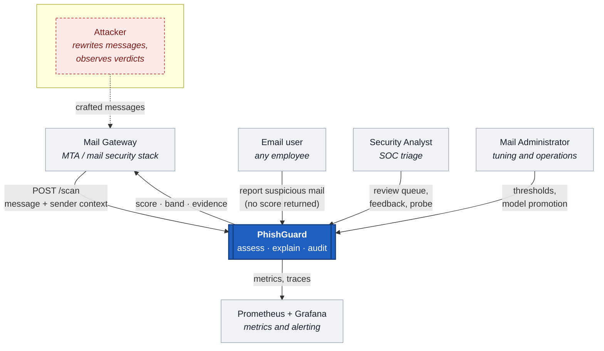

The attacker is drawn on the diagram. They never interact with PhishGuard
directly — they send mail — but every design decision downstream is shaped by
what they can do, so leaving them off the context diagram would be a lie of
omission.

## 2.2 C4 Level 2 — Containers

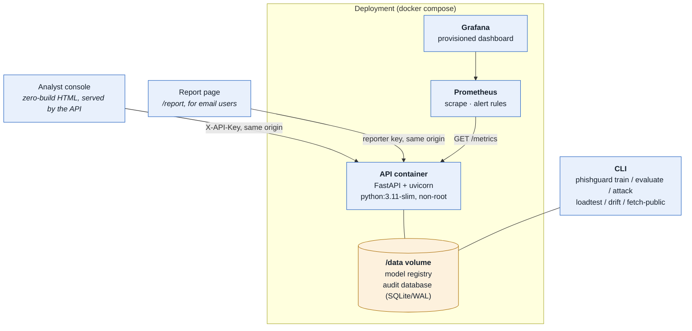

**Why one application container.** The alternative — separate scoring, feature
and API services — buys independent scaling that this workload does not need
(assessment is ~12 ms of CPU and no I/O) and costs a network hop on the inline
mail path plus three more failure modes. The split that *is* worth having is
the one inside the container, between the decision logic and the transport.

**Why SQLite rather than PostgreSQL.** The audit trail is an append-mostly,
single-writer log at modest volume, which is what SQLite is good at. In WAL
mode readers do not block the writer. It makes the container self-contained,
which is what makes "runs on a clean machine from documented instructions"
true rather than aspirational. The store sits behind a narrow interface
(`DecisionStore`), so moving to PostgreSQL is five methods, and
[ADR-004](adr/004-sqlite-audit-store.md) records the trigger for doing so.

## 2.3 C4 Level 3 — Components

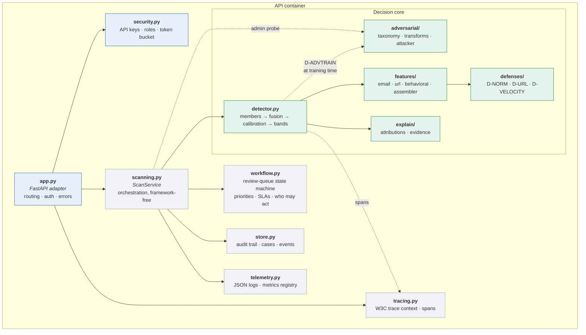

The line that matters is between `app.py` and `scanning.py`. Everything that
decides anything lives in `ScanService` and below, with no web-framework import
anywhere in it. That is why the test suite can exercise the full decision path
— and every review-queue rule — without an HTTP server, and why the FastAPI
layer is thin enough to review by eye. `workflow.py` goes one step further: it
has no storage and no HTTP at all, so every state transition and every
permission rule is a pure function with a unit test.

## 2.4 Assessment data flow

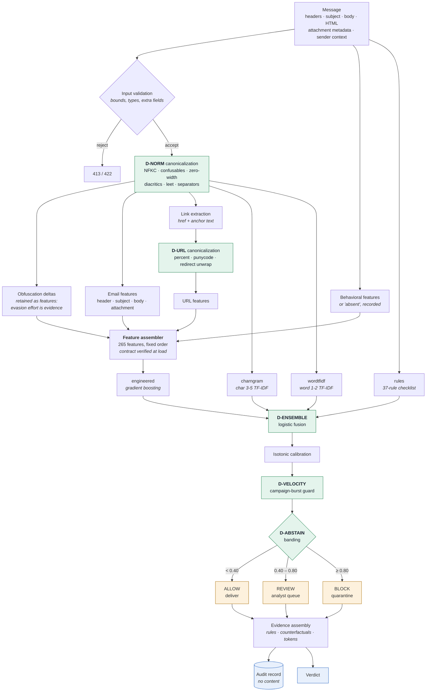

Two things on this diagram are worth pausing on.

**Obfuscation deltas feed forward.** Canonicalization does not discard what it
undid. The difference between the raw and canonical text — how many zero-width
characters, how many mixed-script words, how much the string changed — becomes
nine features. An attacker who obfuscates heavily to defeat the text models
pays for it in the engineered model. Evasion effort is itself evidence.

**Behavioural absence is a feature, not a zero.** When the gateway supplies no
sender history, `beh_context_available` is 0 and the block is at its neutral
defaults. The model learns "no context" as its own regime instead of being fed
misleading zeros, and the verdict says so in the evidence list.

## 2.5 Training and evaluation flow

```mermaid
flowchart LR
    C["Corpus<br/><i>synthetic generator<br/>or public loaders</i>"]
    C --> SPLIT["<b>Campaign-grouped split</b><br/>+ near-duplicate scrub"]
    SPLIT --> AUDIT{"Leakage audit"}
    AUDIT -->|fail| STOP["refuse to train"]
    AUDIT -->|pass| POOLS

    POOLS["Three disjoint pools<br/><i>drawn by campaign</i>"] --> FIT["<b>fit</b> (60%)<br/>members"]
    POOLS --> STACK["<b>stack</b> (22%)<br/>fusion weights"]
    POOLS --> CALP["<b>cal</b> (18%)<br/>calibrator"]

    FIT --> AUG["<b>D-ADVTRAIN</b><br/>augment phishing only"]
    AUG --> MEM["members"]
    MEM --> STACK
    STACK --> FUS["fusion"]
    FUS --> CALP
    CALP --> REG[("model registry<br/><i>+ manifest, contract,<br/>provenance</i>")]

    REG --> EVAL["<b>Evaluation</b><br/>clean · calibration · bands · latency"]
    EVAL --> ATK["<b>Adversarial suite</b><br/>composed + per-family"]
    ATK --> ABL["<b>Ablations</b><br/>modality · defence"]
    ABL --> GATES{"10 acceptance gates"}
    GATES -->|any fail| NOGO["exit 1 — build blocked"]
    GATES -->|all pass| GO["GO<br/>dossier + model card"]

    classDef bad fill:#fce9e8,stroke:#b3261e
    classDef good fill:#e4f4ec,stroke:#1a7f4b
    class STOP,NOGO bad
    class GO good
```

**Why three pools rather than two.** Fitting the fusion on member scores the
members produced *in sample* is the classic way to get a stacker that looks
excellent and generalises badly: the members are near-perfect on their own
training data, so the fusion learns weights for a regime it will never see
again. The calibrator then needs a third pool for the same reason — it must
see fusion outputs it did not shape.

**Why the pools are drawn by campaign.** The same leak the grouped train/test
split closes also exists *inside* training. With row-level pools, most
calibration messages have a near-identical sibling in the fitting pool, so the
members score them with a confidence they will not have on a new campaign. On
this corpus that made the calibration pool look perfectly separated: the
false-alarm budget could not be estimated from it, and the calibrator learned
an optimism that did not transfer. The drift monitor's reference also needs
whole campaigns, because its alarm thresholds are calibrated by resampling
them.

The change was measured before it was kept, in release 1.2.0, over three
training seeds each way; the current model's seed runs are in
[§7.12](07-evaluation-dossier.md). On ordinary test mail the difference was smaller than the spread between
seeds. On PG-HARD it moved the errors rather than removing them: row-level
pools delivered 2–6 of 96 hard phishing records unwarned in every seed and
blocked no legitimate ones; campaign pools delivered 0–4 and, in one seed,
blocked all eight variants of one legitimate case. It is kept for the reason
above — the pools then look like deployment — not because it improved a
headline number.

## 2.6 Feature schema

265 features in three families, in a fixed order that is frozen into the saved
model and verified on load.

### Email family — 125 features

| Block | Count | Representative signals |
|---|---|---|
| Header | 35 | display-name/domain brand mismatch, typosquat edit distance, Reply-To and Return-Path divergence, SPF/DKIM/DMARC, freemail and disposable senders, sender local-part entropy |
| Subject | 23 | length, capitalisation, urgency phrases, reply/forward prefixes, brand mentions, eight lexicon counts |
| Body + HTML | 55 | readability and structure, eight social-engineering lexicons, generic greeting, imperative openings, password inputs, hidden elements, image-only bodies, entity density, **nine obfuscation-delta signals** |
| Attachments | 12 | executable / macro / archive class, double extensions, MIME-extension mismatch, RTL-override filenames |

### URL family — 107 features

Per-URL (39 signals) aggregated to message level by `max` and `mean`, plus 29
message-level roll-ups.

| Group | Representative signals |
|---|---|
| Structure | length, host length, subdomain depth, path segments, digit ratio, host entropy |
| Deception | brand-in-subdomain, brand squatting, typosquat distance, punycode, mixed-script host, `@` in authority, IP host, non-standard port |
| Evasion | shortener, open-redirect parameter, percent-encoding density, unwrap-changed-host |
| Reputation proxies | high-abuse TLD, free-hosting suffix, official brand domain |
| Cross-channel | **link text vs href mismatch** — invisible to any model reading only body text |

`max` captures *the single worst link*, which is what decides the outcome.
`mean` captures *how consistently bad the message is*, which separates a
hijacked newsletter from a purpose-built lure.

### Behavioural family — 33 features

| Group | Signals |
|---|---|
| Relationship | first-seen, prior message and reply counts, saturating relationship strength, thread depth |
| Timing | local hour, off-hours flag, weekend |
| Distribution | recipient count, BCC ratio, mass-mailing flag |
| Reputation | domain age, prior user reports, historic click rate |
| Campaign shape | burst count, display-name reuse across addresses |
| Interactions | cold-contact-with-ask, young-domain-with-ask, off-hours-and-urgent, **trust deficit** (a single 0–1 scalar an analyst can read) |

**Why this family carries the robustness.** Text and URL features live in the
space the attacker directly controls: they can rewrite the sentence and
re-register the domain. Behavioural features live in a space they only
partially control — forging "we have exchanged forty emails over two years"
requires actually having done so. That asymmetry is why the fusion degrades far
more gracefully under attack than a text-only model, and the ablations in
[§7](07-evaluation-dossier.md) quantify it.

## 2.7 Design decisions

Full records in [`docs/adr/`](adr/). Summary:

| ADR | Decision | The alternative, and why not |
|---|---|---|
| [001](adr/001-tri-modal-fusion.md) | Fuse three independent feature families | A single strong text model: higher clean accuracy per unit of effort, and it collapses under exactly the attacks this project is about |
| [002](adr/002-synthetic-corpus.md) | Synthetic corpus as the primary training data | Public corpora: real, but contain no behavioural modality, carry personal data, and cannot be committed |
| [003](adr/003-black-box-threat-model.md) | Decision-based black-box adversary | White-box gradient attacks: standard in the literature, and assume leaked weights, which is a key-rotation problem not a robustness one |
| [004](adr/004-sqlite-audit-store.md) | SQLite in WAL mode for the audit trail | PostgreSQL: correct at multi-node scale, and adds a service, a migration story and a failure mode to a single-node system |
| [005](adr/005-occlusion-explanations.md) | Counterfactual occlusion for tree-model attributions | SHAP: a good approximation, and this problem admits an exact answer to the question the analyst is actually asking |
| [006](adr/006-abstention-band.md) | Three-way ALLOW / REVIEW / BLOCK | Binary decisions: simpler, and they force every uncertain message into a silent error in one direction or the other |
| [007](adr/007-review-queue-state-machine.md) | The review queue as an explicit state machine with object-level authorisation | A view over decisions with an assignee column: smaller, and unable to express who may move a case from where to where |
| [008](adr/008-in-process-tracing.md) | In-process tracing with W3C Trace Context, no collector | The OpenTelemetry SDK and a collector: the standard, and one more service a laptop install would need; same wire format, so it remains a drop-in later |

## 2.8 Sequence diagrams

Three interactions carry the system: a message assessed inline, a report from an
email user worked through to a decision, and a new model trained and promoted.

### Inline assessment of one message

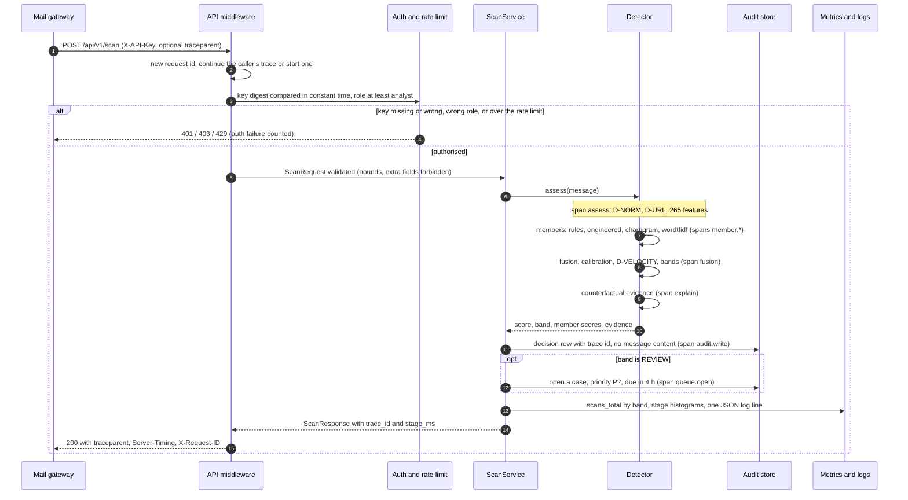

The gateway never waits on anything but CPU: no URL is resolved, no attachment
opened, no external service called. That is what keeps the p95 inside the
inline budget, and it is also a security property (misuse case M5).

### From a user's report to an analyst's decision

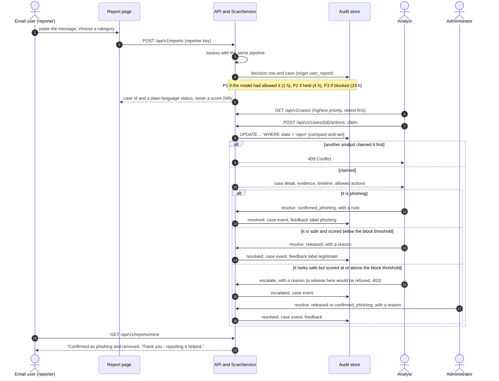

### Retraining, the gates, and promotion

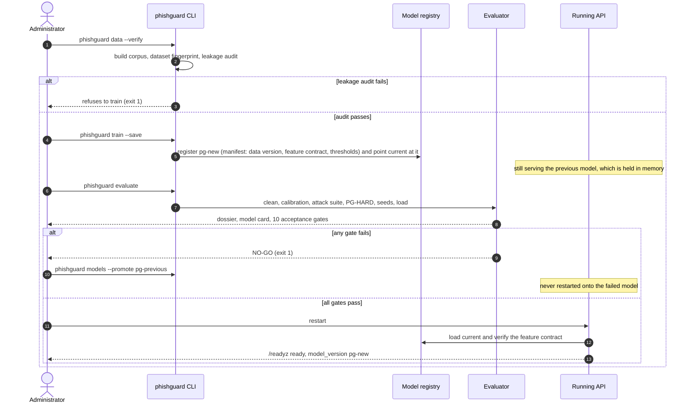

Rollback after a promotion is the same last step in reverse:
`phishguard models --promote <previous>` and a restart ([§9.15](09-admin-user-guide.md)).

## 2.9 Review-queue lifecycle

A REVIEW band is a promise that a person will look at the message. The queue is
what keeps that promise: every held message and every user report becomes a
**case** with a state, an owner, a priority and a service level.

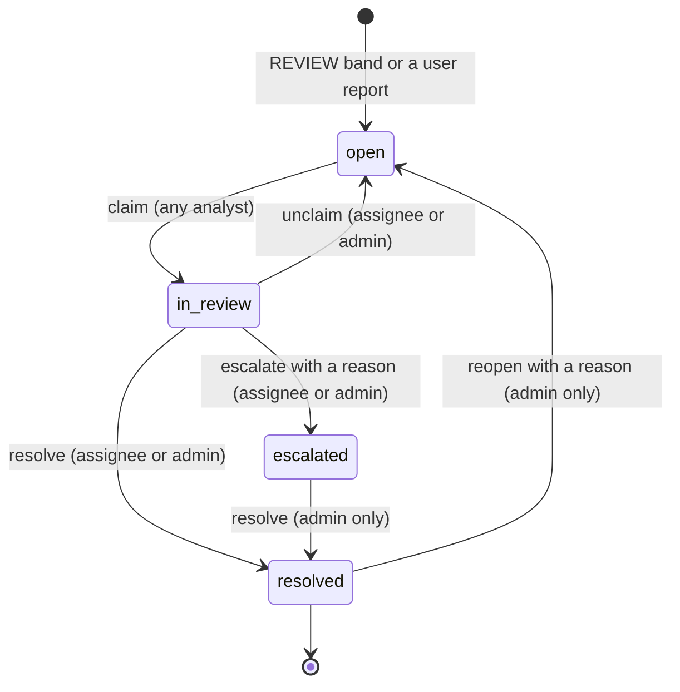

| Rule | Why | Enforced in |
|---|---|---|
| Only the analyst who claimed a case, or an administrator, can release, resolve or escalate it | Object-level authorisation (OWASP API1): owning a case is a permission, not a label | `workflow.decide` |
| Releasing a message scored at or above the block threshold needs an administrator | It is the single action an attacker most wants an analyst to take (misuse case M10) | `workflow.decide` |
| A release, an escalation and a reopen all need a written reason | The reason is what an auditor reads later | `workflow.decide` |
| State changes are compare-and-set on the current state | Two analysts clicking "claim" at once cannot both win; a stale browser tab cannot overwrite a decision | `DecisionStore.apply_transition` |
| Every action is an event with actor, role, both states and the note | Repudiation (STRIDE R): the history is the evidence | `case_events` table |
| Resolving records analyst feedback | Queue outcomes feed the disagreement metric without a second step, and never retrain anything automatically (`OOS-3`) | `ScanService.act_on_case` |
| Reporters see a status in plain words, never a score or band | A reporting endpoint that returned the verdict would be a scoring oracle (M9) | `workflow.reporter_status` |

**Priorities and service levels.** P1, 1 hour: a user reported a message the
model *allowed* — possibly a phish in inboxes now. P2, 4 hours: a message held
for review; a recipient is waiting for it. P3, 24 hours: a report on mail the
model already blocked. Overdue cases are a Prometheus gauge with an alert rule.

## 2.10 Audit database schema

One SQLite file in WAL mode ([ADR-004](adr/004-sqlite-audit-store.md)),
schema version 2. Older databases are migrated in place on start-up. No table
holds message content: subjects are salted digests, senders are pseudonyms, and
evidence is stored as the titles of the evidence items, not the text they quote.

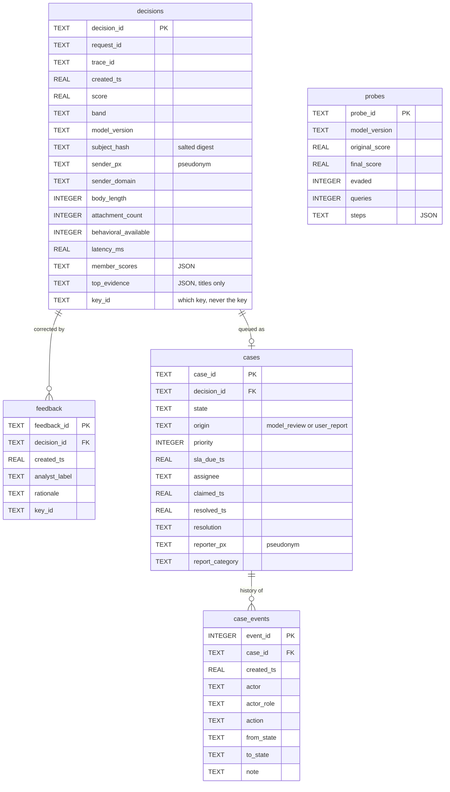

Indexes follow the queries the service actually makes: decisions by time, band
and sender domain; cases by state, priority and age; events by case. Retention
is a sweep that deletes decisions older than the configured window **except**
those still attached to an active case, so a slow investigation never loses its
evidence.

The feature schema — the model's input, as opposed to the database — is §2.6,
and field-by-field in the data dictionary ([§6.5](06-data-dictionary.md)).

## 2.11 UI prototype

The interface is working software rather than mock-ups: two zero-build HTML
pages shipped inside the Python package and served by the API, so they are
present in the wheel and the container image and need no build step.

| Page | Who | What it does |
|---|---|---|
| **Analyst console** (`/`) | Analyst, administrator | *Assess a message* — paste a message or load a worked example; score, band, member scores and plain-language evidence; "where the time went" per stage. *Review queue* — tiles for waiting, overdue and P1 cases; a table by priority and age; a case view with evidence, timeline and only the actions this key may take. *Decision history* — the audit trail (admin). *Adversarial probe* — "would this get through if the attacker tried harder?" (admin). *Hard-case benchmark* — PG-HARD results against both baselines. *Model & monitoring* — model version, thresholds, operational statistics and the drift check |
| **Report page** (`/report`) | Any email user with a reporter key | Report a message in one step, choose a category, and see "My reports" with a plain-language status for each. Never shows a score |

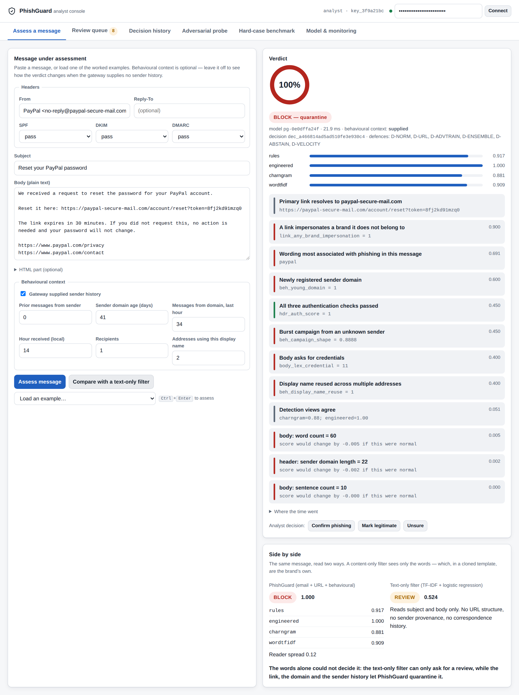

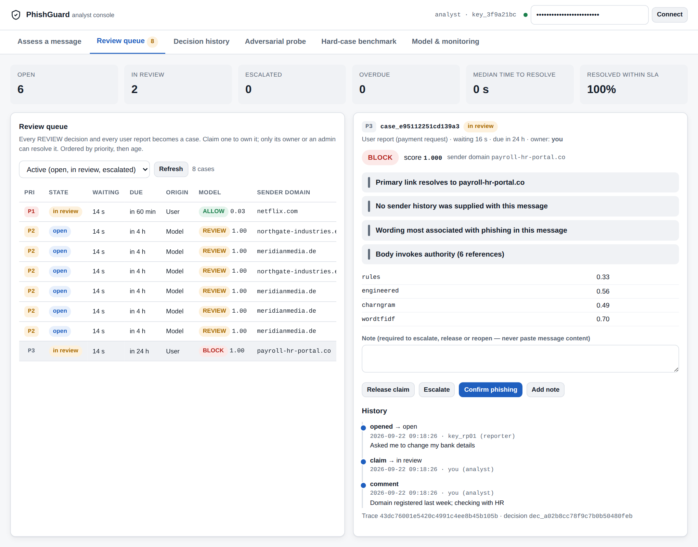

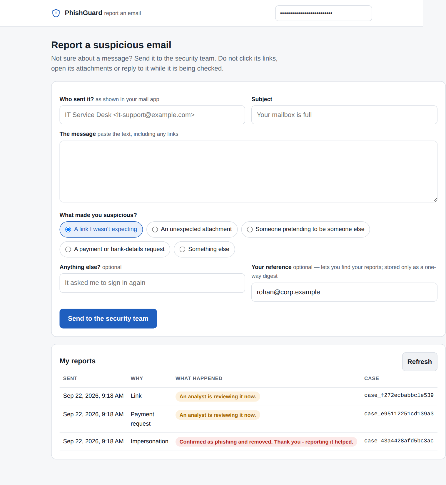

Design choices that follow from the personas: evidence is written as sentences,
not feature names (Meera has forty seconds); buttons a key may not use are not
shown at all rather than failing when pressed; the reporter's page contains no
number anywhere (M9); every screen works without JavaScript frameworks or a
network connection beyond the API itself.

## 2.12 Observability design

Three signals, each answering a different operator question.

| Signal | Question it answers | Implementation |
|---|---|---|
| **Logs** | What happened to this request? | One structured JSON line per request with request id, trace id, key id, endpoint, status and latency — never message content |
| **Metrics** | Is the system healthy right now, and is it drifting? | Prometheus exposition at `/metrics`: requests, scans by band, latency histograms, per-stage histograms, queue depth and overdue cases, feedback, auth failures, probes; Grafana dashboard and alert rules provisioned |
| **Traces** | Where did the time go in *this* slow request? | W3C Trace Context: an incoming `traceparent` is continued, otherwise one is started; spans for `assess`, each `member.*`, `fusion`, `explain`, `audit.write` and `queue.open`; returned as `traceparent` and `Server-Timing` headers and as `stage_ms` in the response; the last 50 traces at `GET /api/v1/traces/recent` (admin) |

Tracing is in-process on purpose: the stage timings are recorded with
`contextvars`, cost microseconds, and need no collector, so they work on a
laptop and in an air-gapped deployment alike. Because the header format is the
W3C standard, a gateway that already runs OpenTelemetry sees PhishGuard's trace
id as part of its own trace, and exporting spans to a collector later is an
adapter, not a redesign ([ADR-008](adr/008-in-process-tracing.md)).

The traces found a real defect before release. Scoring inside a server worker
thread took about three times as long as the same call on the main thread;
the per-stage timings put the whole difference in the two stages that use
OpenMP, and limiting OpenMP to one thread per serving thread
(`runtime.py`) took single-worker p50 from 36.6 ms to 11.7 ms
([§7.14](07-evaluation-dossier.md)).

---

**Next:** [§3 API and data contracts →](03-api-contract.md)
