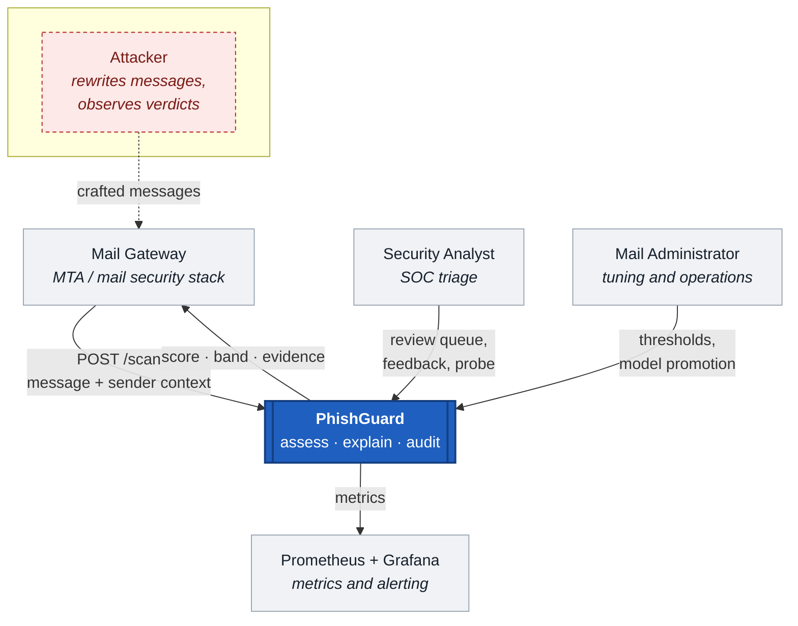
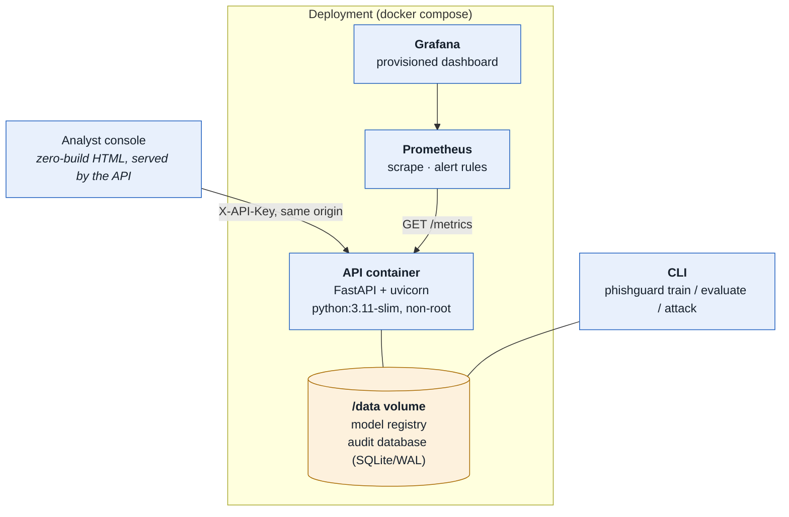
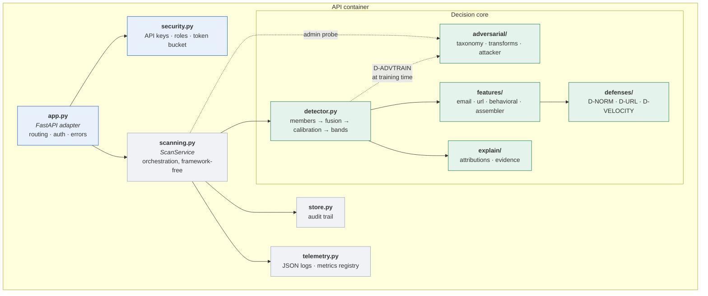
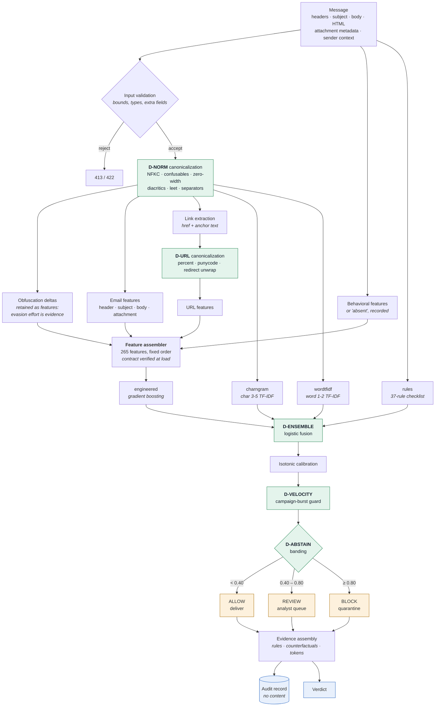

# 2. Solution design pack

C4 architecture, data flow, feature schema, and the design decisions that
matter, with the reasoning behind each one.

---

## 2.1 C4 Level 1 — System context

The attacker is drawn on the diagram. They never interact with PhishGuard
directly — they send mail — but every design decision downstream is shaped by
what they can do, so leaving them off the context diagram would be a lie of
omission.

## 2.2 C4 Level 2 — Containers

**Why one application container.** The alternative — separate scoring, feature
and API services — buys independent scaling that this workload does not need
(assessment is ~11 ms of CPU and no I/O) and costs a network hop on the inline
mail path plus three more failure modes. The split that *is* worth having is
the one inside the container, between the decision logic and the transport.

**Why SQLite rather than PostgreSQL.** The audit trail is an append-mostly,
single-writer log at modest volume, which is what SQLite is good at. In WAL
mode readers do not block the writer. It makes the container self-contained,
which is what makes "runs on a clean machine from documented instructions"
true rather than aspirational. The store sits behind a narrow interface
(`DecisionStore`), so moving to PostgreSQL is five methods, and
[ADR-004](adr/004-sqlite-audit-store.md) records the trigger for doing so.

## 2.3 C4 Level 3 — Components

The line that matters is between `app.py` and `scanning.py`. Everything that
decides anything lives in `ScanService` and below, with no web-framework import
anywhere in it. That is why 153 tests can exercise the full decision path
without an HTTP server, and why the FastAPI layer is thin enough to review by
eye.

## 2.4 Assessment data flow

Two things on this diagram are worth pausing on.

**Obfuscation deltas feed forward.** Canonicalization does not discard what it
undid. The difference between the raw and canonical text — how many zero-width
characters, how many mixed-script words, how much the string changed — becomes
nine features. An attacker who obfuscates heavily to defeat the text models
pays for it in the engineered model. Evasion effort is itself evidence.

**Behavioural absence is a feature, not a zero.** When the gateway supplies no
sender history, `beh_context_available` is 0 and the block is at its neutral
defaults. The model learns "no context" as its own regime instead of being fed
misleading zeros, and the verdict says so in the evidence list.

## 2.5 Training and evaluation flow

```mermaid
flowchart LR
    C["Corpus<br/><i>synthetic generator<br/>or public loaders</i>"]
    C --> SPLIT["<b>Campaign-grouped split</b><br/>+ near-duplicate scrub"]
    SPLIT --> AUDIT{"Leakage audit"}
    AUDIT -->|fail| STOP["refuse to train"]
    AUDIT -->|pass| POOLS

    POOLS["Three disjoint pools"] --> FIT["<b>fit</b> (60%)<br/>members"]
    POOLS --> STACK["<b>stack</b> (22%)<br/>fusion weights"]
    POOLS --> CALP["<b>cal</b> (18%)<br/>calibrator"]

    FIT --> AUG["<b>D-ADVTRAIN</b><br/>augment phishing only"]
    AUG --> MEM["members"]
    MEM --> STACK
    STACK --> FUS["fusion"]
    FUS --> CALP
    CALP --> REG[("model registry<br/><i>+ manifest, contract,<br/>provenance</i>")]

    REG --> EVAL["<b>Evaluation</b><br/>clean · calibration · bands · latency"]
    EVAL --> ATK["<b>Adversarial suite</b><br/>composed + per-family"]
    ATK --> ABL["<b>Ablations</b><br/>modality · defence"]
    ABL --> GATES{"10 acceptance gates"}
    GATES -->|any fail| NOGO["exit 1 — build blocked"]
    GATES -->|all pass| GO["GO<br/>dossier + model card"]

    classDef bad fill:#fce9e8,stroke:#b3261e
    classDef good fill:#e4f4ec,stroke:#1a7f4b
    class STOP,NOGO bad
    class GO good
```

**Why three pools rather than two.** Fitting the fusion on member scores the
members produced *in sample* is the classic way to get a stacker that looks
excellent and generalises badly: the members are near-perfect on their own
training data, so the fusion learns weights for a regime it will never see
again. The calibrator then needs a third pool for the same reason — it must
see fusion outputs it did not shape.

## 2.6 Feature schema

265 features in three families, in a fixed order that is frozen into the saved
model and verified on load.

### Email family — 125 features

| Block | Count | Representative signals |
|---|---|---|
| Header | 35 | display-name/domain brand mismatch, typosquat edit distance, Reply-To and Return-Path divergence, SPF/DKIM/DMARC, freemail and disposable senders, sender local-part entropy |
| Subject | 23 | length, capitalisation, urgency phrases, reply/forward prefixes, brand mentions, eight lexicon counts |
| Body + HTML | 55 | readability and structure, eight social-engineering lexicons, generic greeting, imperative openings, password inputs, hidden elements, image-only bodies, entity density, **nine obfuscation-delta signals** |
| Attachments | 12 | executable / macro / archive class, double extensions, MIME-extension mismatch, RTL-override filenames |

### URL family — 107 features

Per-URL (39 signals) aggregated to message level by `max` and `mean`, plus 29
message-level roll-ups.

| Group | Representative signals |
|---|---|
| Structure | length, host length, subdomain depth, path segments, digit ratio, host entropy |
| Deception | brand-in-subdomain, brand squatting, typosquat distance, punycode, mixed-script host, `@` in authority, IP host, non-standard port |
| Evasion | shortener, open-redirect parameter, percent-encoding density, unwrap-changed-host |
| Reputation proxies | high-abuse TLD, free-hosting suffix, official brand domain |
| Cross-channel | **link text vs href mismatch** — invisible to any model reading only body text |

`max` captures *the single worst link*, which is what decides the outcome.
`mean` captures *how consistently bad the message is*, which separates a
hijacked newsletter from a purpose-built lure.

### Behavioural family — 33 features

| Group | Signals |
|---|---|
| Relationship | first-seen, prior message and reply counts, saturating relationship strength, thread depth |
| Timing | local hour, off-hours flag, weekend |
| Distribution | recipient count, BCC ratio, mass-mailing flag |
| Reputation | domain age, prior user reports, historic click rate |
| Campaign shape | burst count, display-name reuse across addresses |
| Interactions | cold-contact-with-ask, young-domain-with-ask, off-hours-and-urgent, **trust deficit** (a single 0–1 scalar an analyst can read) |

**Why this family carries the robustness.** Text and URL features live in the
space the attacker directly controls: they can rewrite the sentence and
re-register the domain. Behavioural features live in a space they only
partially control — forging "we have exchanged forty emails over two years"
requires actually having done so. That asymmetry is why the fusion degrades far
more gracefully under attack than a text-only model, and the ablations in
[§7](07-evaluation-dossier.md) quantify it.

## 2.7 Design decisions

Full records in [`docs/adr/`](adr/). Summary:

| ADR | Decision | The alternative, and why not |
|---|---|---|
| [001](adr/001-tri-modal-fusion.md) | Fuse three independent feature families | A single strong text model: higher clean accuracy per unit of effort, and it collapses under exactly the attacks this project is about |
| [002](adr/002-synthetic-corpus.md) | Synthetic corpus as the primary training data | Public corpora: real, but contain no behavioural modality, carry personal data, and cannot be committed |
| [003](adr/003-black-box-threat-model.md) | Decision-based black-box adversary | White-box gradient attacks: standard in the literature, and assume leaked weights, which is a key-rotation problem not a robustness one |
| [004](adr/004-sqlite-audit-store.md) | SQLite in WAL mode for the audit trail | PostgreSQL: correct at multi-node scale, and adds a service, a migration story and a failure mode to a single-node system |
| [005](adr/005-occlusion-explanations.md) | Counterfactual occlusion for tree-model attributions | SHAP: a good approximation, and this problem admits an exact answer to the question the analyst is actually asking |
| [006](adr/006-abstention-band.md) | Three-way ALLOW / REVIEW / BLOCK | Binary decisions: simpler, and they force every uncertain message into a silent error in one direction or the other |

---

**Next:** [§3 API and data contracts →](03-api-contract.md)
