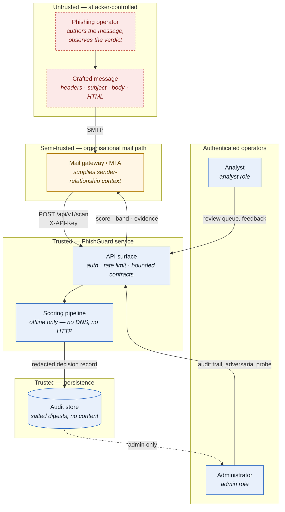

# 4. Threat model

Who the adversary is, what they can and cannot do, what the system defends
against, what it deliberately does not, and what the measurements actually show.

---

## 4.1 Scope and method

This document covers two threat surfaces that are routinely conflated in
phishing-detection work and are analysed separately here.

The first is **attacks on the model**: an operator rewriting a message so that
the classifier scores it below the block threshold while the lure still works on
the victim. This is adversarial evasion, and it is the project's distinguishing
contribution — most detection work reports clean accuracy and stops, which
measures the wrong thing for a system whose entire input is written by someone
who wants it to fail.

The second is **attacks on the service**: the API, the audit store, the
container, the analyst console. This is ordinary application security, but it is
not optional. A robust model behind an API that leaks the audit trail or can be
queried without a key is not a defensible system.

The method differs by surface because the surfaces differ. STRIDE is used for
the service, where the assets are conventional and the threat categories are
well-established (§4.8). For the model, STRIDE says nothing useful, so a custom
capability-bounded taxonomy is used instead: six attack families, each defined
by what the attacker must be able to do, each mapped to a named defensive
control, each scored independently (§4.5, §4.7). The capability model in §4.4 is
the load-bearing part — it is what makes the robustness numbers mean something.

## 4.2 Assets

| Asset | Why it matters | Primary threat |
|---|---|---|
| Recipient credentials and funds | The thing the attacker is actually after. A single delivered credential-harvest message can cost an account, and through it a domain | Evasion (all six families) |
| Decision integrity of the model | If the score can be steered, every downstream control that consumes it inherits the flaw | Evasion; model-artefact tampering |
| Confidentiality of the audit trail | Decision records describe who corresponded with whom. An insider reading them is a privacy breach even though no message body is stored | Information disclosure; insider misuse (M4) |
| Availability on the inline mail path | Assessment is synchronous inside the gateway's per-message budget. If PhishGuard stalls, mail queues, and the operational answer to queued mail is to switch the filter off | Resource exhaustion; hostile input (M2) |
| The analyst's attention | A genuine asset, and the one most easily destroyed. Every false positive and every low-value review item spends it, and an analyst who has stopped reading the queue is equivalent to no queue at all | False-positive pressure; review-band inflation |
| Model artefacts and the registry | Weights are the boundary between the black-box threat model here and the white-box one that is out of scope (`OOS-2`) | Artefact exfiltration |

## 4.3 Trust boundaries

Four boundaries are crossed. Message content crosses from fully attacker-
controlled into the gateway; nothing in it is ever trusted. Sender-relationship
context crosses from the gateway into the API and *is* trusted, which is an
assumption recorded in §4.11. Decision records cross into the store, and only in
redacted form. Operator requests cross into the API and are separated by role.

## 4.4 The adversary (capability model)

The adversary modelled here is **a competent phishing operator with full control
of the message they send and black-box query access to the detector's verdict,
under a query budget**. This is the realistic worst case rather than a
convenient one: commercial phishing kits are routinely tested against public
scanners before a campaign launches, so assuming the attacker can observe a
verdict and iterate is not pessimism, it is current practice.

They **can** rewrite any part of the message they author — subject, body, HTML
part, display name, Reply-To, attachment names. They can choose their own
infrastructure: domain, host, path, redirect chains, shortener wrapping,
punycode registration. They can choose when and how fast to send — time of day,
pacing, recipient count, whether the subject is framed as a reply. They can
observe the detector's score for a candidate message and iterate on it, up to a
query budget.

They **cannot** change the recipient's history with them: prior correspondence
volume and reply ratio are properties of the victim's mailbox, not of the
message. They cannot age their own domain retroactively, or erase user reports
already filed against it. They cannot make the brand's genuine domain send the
mail — taking over `paypal.com` is domain compromise, a different threat with
different controls, excluded as `OOS-1`. And they cannot see model weights or
gradients: this is a black-box, decision-based threat model, not a white-box
one (`OOS-2`).

Getting that boundary right is the whole exercise. Draw it too wide — assume the
attacker can do anything — and every defence fails by construction, so the
robustness number is trivially pessimistic and carries no information. Draw it
too narrow — assume they can only add typos — and the number is trivially
optimistic and carries no information either. The boundary above is chosen so
that each capability corresponds to something a real operator demonstrably does.

The boundaries are enforced mechanically rather than by convention. The
behavioural transforms in `adversarial/transforms.py` mutate only
attacker-controlled fields, so no attack in the suite can rewrite the victim's
correspondence history. And `payload_preserved` rejects any candidate that has
stopped being a working phishing message, on three necessary conditions:
reachability (if the original carried links, at least one must survive and still
resolve to an original destination host, with shortener wrapping accepted
because the victim still lands on the same page), the ask (an actionable request
must remain in the visible text), and non-degeneracy (the message may not
collapse to near-nothing, measured across all channels the victim sees). Without
these checks, an "attack" that empties the body would count as a successful
evasion and the robustness numbers would be meaningless.

## 4.5 Attack taxonomy

Six families, chosen so that each maps to a distinct defensive control and can
be scored independently in the residual-risk register. Thirty transforms across
them.

| ID | Name | Capability required | Attacker cost | Victim-visible | Countered by |
|---|---|---|---|---|---|
| **A-LEX** | Lexical and semantic perturbation | Free — the attacker authors the text | Low | No — the lure reads normally, often better | D-NORM, D-ADVTRAIN, D-ENSEMBLE, D-ABSTAIN |
| **A-UNI** | Unicode and homoglyph obfuscation | Free — any mail client renders these identically | Low | Barely — rendering is near-identical | D-NORM, D-ADVTRAIN |
| **A-URL** | URL obfuscation and redirection | Cheap — a redirect host or a shortener account | Low to medium | Yes, if the victim inspects the link before clicking | D-URL, D-ADVTRAIN, D-ENSEMBLE |
| **A-STRUCT** | Structural and HTML manipulation | Free — the attacker authors the HTML part | Low | No | D-NORM, D-ENSEMBLE, D-ADVTRAIN |
| **A-HDR** | Header and identity shaping | Cheap for the attacker's own domain; impossible for the brand's real domain, which is `OOS-1` | Medium | No — improves the lure's credibility | D-ENSEMBLE, D-ABSTAIN |
| **A-BEH** | Behavioural and timing mimicry | Send time, pacing and framing only; cannot fabricate correspondence history or domain age | High — low-and-slow sending cuts campaign reach | No | D-VELOCITY, D-ENSEMBLE, D-ABSTAIN |

Effectiveness below is measured per family over 120 attacked messages each, at
the deployed operating point (block threshold 0.8, review threshold 0.4), under
a query budget of 12. Attack success means the score fell below 0.8, so the
message is no longer auto-quarantined; silent delivery means it fell below 0.4
and would reach the inbox with no human review.

### A-LEX — Lexical and semantic perturbation

`A-LEX-01` synonym substitution, `A-LEX-02` typo injection, `A-LEX-03` benign
padding, `A-LEX-04` tone softening, `A-LEX-05` deadline removal. Attack success
rate **0.01667** (2 of 120 escaped the block band), silent delivery **0.0**,
mean score drop **0.00243**, median queries to evade **4.5**.

### A-UNI — Unicode and homoglyph obfuscation

`A-UNI-01` homoglyph substitution, `A-UNI-02` zero-width insertion, `A-UNI-03`
leetspeak, `A-UNI-04` word splitting, `A-UNI-05` combining diacritics. Attack
success rate **0.03333** (4 of 120), silent delivery **0.0**, mean score drop
**0.01066**, median queries to evade **5.0**. Jointly the most effective family
with A-URL.

### A-URL — URL obfuscation and redirection

`A-URL-01` shortener wrapping, `A-URL-02` open-redirect chaining, `A-URL-03`
percent-encoding, `A-URL-04` subdomain padding, `A-URL-05` path and query noise,
`A-URL-06` scheme downgrade. Attack success rate **0.03333** (4 of 120), silent
delivery **0.0**, mean score drop **0.01091**, median queries to evade **10.5** —
the most expensive family to land, roughly twice the query cost of A-LEX.

### A-STRUCT — Structural and HTML manipulation

`A-STR-01` HTML entity encoding, `A-STR-02` invisible span injection, `A-STR-03`
text-as-image, `A-STR-04` markup noise. Attack success rate **0.00833** (1 of
120), silent delivery **0.0**, mean score drop **0.00031**, median queries to
evade **5.0**.

### A-HDR — Header and identity shaping

`A-HDR-01` drop divergent Reply-To, `A-HDR-02` neutral display name, `A-HDR-03`
authentication alignment, `A-HDR-04` Return-Path alignment, `A-HDR-05`
attachment renaming, `A-HDR-06` hop reduction. Attack success rate **0.01667**
(2 of 120), silent delivery **0.0**, mean score drop **0.00514**, median queries
to evade **7.0**.

### A-BEH — Behavioural and timing mimicry

`A-BEH-01` business-hours delivery, `A-BEH-02` low-and-slow sending, `A-BEH-03`
thread framing, `A-BEH-04` single sending identity. Attack success rate
**0.00833** (1 of 120), silent delivery **0.0**, mean score drop **0.00067**,
median queries to evade **2.0**. The lowest measured effect and the highest real
cost, because the transforms that move the behavioural block are exactly the
ones that shrink the campaign.

## 4.6 Defensive controls

| ID | What it does | Counters | Cost | Residual gap |
|---|---|---|---|---|
| **D-NORM** | NFKC normalisation, zero-width and bidi stripping, confusable folding, diacritic removal, leetspeak folding, separator rejoining and run collapsing before any text feature is computed; the obfuscation deltas are kept as features so evasion effort is itself evidence | A-LEX, A-UNI | ~0.15 ms/message; no measurable clean-accuracy loss | Confusables outside the curated table, and paraphrase attacks that use no obfuscation at all, pass through unchanged |
| **D-URL** | Percent-decoding, punycode decoding, host homoglyph folding and recursive unwrapping of open-redirect and shortener parameters, so the extractor scores the destination the victim actually reaches | A-URL | ~0.1 ms/URL; strictly offline, no DNS or HTTP | A shortener whose target is not embedded in the query string cannot be resolved offline; the wrapper itself remains a feature |
| **D-ADVTRAIN** | Each phishing training example is augmented with attacked variants from the full transform suite, fitting the boundary on the perturbed manifold rather than only on pristine text | A-LEX, A-UNI, A-URL, A-STRUCT | Training set grows by the augmentation multiplier; inference unchanged | Generalises to unseen transforms only as far as they resemble the training perturbations; a genuinely novel family is out of scope |
| **D-ENSEMBLE** | Calibrated stacker over rule, engineered-feature, character-n-gram and word-n-gram members reading different views, so a perturbation that lowers one member often raises another | A-LEX, A-UNI, A-STRUCT, A-HDR | ~4× single-model inference; still sub-10 ms/message on CPU | Members share the text channel, so a strong semantic paraphrase moves them together; behavioural features are the decorrelating leg |
| **D-ABSTAIN** | Three-way decision — ALLOW below the review threshold, BLOCK above the block threshold, REVIEW in between, queued for an analyst instead of auto-decided | All six | Analyst time proportional to the review-band width | An attack that pushes a message below the review threshold still evades silently; banding converts some evasions into review load, not zero |
| **D-VELOCITY** | Decision-time escalation raising the score when a sender domain arrives in an unusual burst from an unknown contact, using the behavioural block rather than content; bounded to +0.15 and monotone | A-BEH, A-LEX | One bounded arithmetic adjustment; no extra model call | Low-and-slow, individually targeted spear-phishing produces no burst and is unaffected |

## 4.7 Measured residual risk

Against the full composed attack — every family available to the search, 120
messages, budget 12 — the attack success rate is **0.06667** (8 messages escaped
the block band) and the silent delivery rate is **0.00833** (1 message reached
the ALLOW band). Mean final score **0.96497**; mean score drop **0.02795**,
median **0.00052**, maximum **0.63492**; mean **21.14** queries spent, median
**24.0** queries for those that evaded. Macro F1 moves from **0.99948** clean to
**0.99897** under attack, a drop of **0.00051**; recall from **0.999** to
**0.998**. Measured against the calibrated score the deployed API actually
returns rather than the raw surface, attack success falls to **0.01667**,
because the calibrator quantises the signal available to an attacker.

The residual-risk register scores every family as **likelihood: very low**, with
residual risk **low** for A-LEX, A-UNI, A-URL and A-STRUCT and **very low** for
A-HDR and A-BEH. Impact is **high** for A-LEX, A-UNI, A-URL and A-STRUCT — the
victim reaches the landing page with the lure intact — and **medium** for A-HDR
and A-BEH, which improve credibility or timing without themselves delivering the
payload.

### Leave-one-out ablation

| Arm | Clean macro F1 | Clean FPR | Adversarial macro F1 | Attack success | Silent delivery | ASR vs full |
|---|---|---|---|---|---|---|
| All defences | 0.99948 | 0.0 | 0.99948 | 0.03333 | 0.0 | — |
| without D-NORM | 0.99948 | 0.0 | 0.99897 | 0.03333 | 0.0 | 0.0 |
| without D-URL | 0.9969 | 0.00533 | 0.99897 | 0.025 | 0.00833 | −0.00833 |
| without D-ADVTRAIN | 0.99897 | 0.0 | 0.99483 | **0.10833** | **0.05833** | **+0.075** |
| without D-ENSEMBLE | 0.99845 | 0.00107 | 0.99535 | **0.075** | **0.05** | **+0.04167** |
| without D-ABSTAIN | 0.99948 | 0.0 | 0.99948 | 0.03333 | 0.0 | 0.0 |
| without D-VELOCITY | 0.99948 | 0.0 | 0.99948 | 0.03333 | 0.0 | 0.0 |
| No defences | 0.99793 | 0.00107 | 0.99019 | **0.125** | **0.1** | **+0.09167** |

The ablation arms are measured on their own harness and compared against each
other; the "all defences" reference here is 0.03333, not the 0.06667 headline
figure above, which comes from a different attack configuration.

**Two controls carry the measurable robustness.** Removing D-ADVTRAIN more than
triples the escape rate, from 0.03333 to 0.10833, and takes silent delivery from
zero to 0.05833 — one message in seventeen reaching the inbox unreviewed.
Removing D-ENSEMBLE raises it to 0.075 with silent delivery at 0.05. Removing
both, along with everything else, gives 0.125 and 0.1. Adversarial training and
multi-view fusion are doing the work.

**Three controls show no measurable effect on this metric, and it would be
dishonest to claim otherwise.** D-NORM, D-ABSTAIN and D-VELOCITY all leave the
attack success rate at exactly 0.03333 with silent delivery at 0.0. That is the
measurement, and the explanation matters more than the number.

D-ABSTAIN and D-VELOCITY *cannot* register on this metric by construction. Both
operate downstream of the raw score that the ablation attacks: the abstention
band is a threshold policy applied to a score, and the velocity guard is a
bounded adjustment applied to a score. Attacking the raw surface and then asking
whether a downstream banding policy changed it is asking the wrong question of
the wrong number. This is a measurement limitation, not evidence that the
controls are inert. Their value appears in the banded outcome instead, where
under attack the review rate rises from 0.00258 to 0.00568 and phishing messages
routed to an analyst rise from 5 to 11, while messages missed outright rise only
from 1 to 2 and no legitimate mail is blocked in either condition. The band is
absorbing evasion pressure as review load rather than as silent delivery, which
is exactly what it exists to do.

D-NORM's null result has a different and less comfortable explanation: its
effect is most likely masked because the ensemble already resists the unicode
family without it. Removing D-NORM does cost a little adversarial macro F1
(0.99948 to 0.99897), so the control is not doing nothing, but on a corpus where
character- and word-n-gram members plus adversarial training already absorb
A-UNI, canonicalisation has little left to contribute. It would matter
considerably more in a text-only deployment with a single model, which is the
configuration most published phishing detectors actually ship.

D-URL is a fourth case worth stating plainly. Removing it *lowers* the escape
rate slightly, to 0.025, but simultaneously introduces silent delivery at
0.00833 where the full stack has none, costs clean macro F1 (0.9969 against
0.99948) and pushes the clean false-positive rate from 0.0 to 0.00533. On the
binding constraint — false positives — D-URL earns its place; on the raw attack
success rate alone it does not, and a single 120-message arm is too small to
distinguish an 0.00833 difference from noise in either direction.

## 4.8 STRIDE analysis of the service

| Category | Threat to this system | Control | Where |
|---|---|---|---|
| **Spoofing** | An unauthenticated caller submits scans, or a stolen key is guessed by timing the comparison | API keys compared in constant time (`hmac.compare_digest`) against stored SHA-256 digests, never against plaintext and never logged; the loop runs over every digest so neither an early match nor the number of keys is observable; the service refuses to start in production without `PG_API_KEYS` rather than falling back to a default (M7) | `service/security.py` — `ApiKeyAuthenticator`, `build_security` |
| **Tampering** | Hostile input crafted to corrupt parsing or reach the store; injection through a filter parameter | Every request contract sets `extra="forbid"`, so unknown fields are rejected rather than silently ignored; bounded lengths on subject, body, HTML, sender, Reply-To, Return-Path, recipients and attachments; batches capped at 100; parameterised SQL throughout the store | `service/contracts.py`, `service/store.py`; `tests/security/test_security.py` |
| **Repudiation** | An analyst or administrator denies having made a decision or a correction; an incident cannot be reconstructed | Every request carries an unguessable request ID, echoed as `X-Request-ID` and emitted in structured logs; every decision is persisted with its request ID, the calling `key_id`, timestamp, score, band, model version and top evidence titles; feedback is recorded against the decision ID | `service/security.py` — `new_request_id`; `service/app.py`; `service/store.py`; `service/telemetry.py` |
| **Information disclosure** | An insider reads colleagues' mail through the audit trail (M4); the scanner is used as an SSRF primitive or as an oracle for victim activity (M5) | No message content is stored — rows hold a salted subject digest, a pseudonymised sender, the domain, sizes, the score and evidence titles, which is enough to investigate and not enough to reconstruct anyone's mail; the salt makes the subject digest non-reversible against a short-subject dictionary; logs never carry content; the audit trail is admin-only; decision IDs come from `secrets`; retention is bounded and swept. The system never resolves a URL or opens an attachment — every URL signal is lexical and strictly offline | `schemas.py` — `pseudonymize`, `redacted`; `service/store.py`; `retention_sweep`; `tests/security/test_security.py` |
| **Denial of service** | A caller floods the inline path, or one crafted message hangs the scanner and backs up the gateway (M2) | Per-key token-bucket limiter, chosen over a fixed window because gateway traffic is bursty and a fixed window either rejects a legitimate burst or permits double the rate across a boundary; hard body-size cap (1 MB default); bounded batch sizes; permissive parsers that do not raise; no unbounded regex backtracking on attacker-controlled input; container memory limit; liveness independent of the model | `service/security.py` — `TokenBucketLimiter`, `SecurityConfig.max_body_bytes`; `docker-compose.yml` |
| **Elevation of privilege** | An analyst reaches the audit trail or the adversarial probe; a container escape from the API process | Two roles with an explicit hierarchy — scanning and feedback require `analyst`, the audit trail and the adversarial probe require `admin`; the probe is admin-gated precisely because it reports which edits reduce a score, which is what a defender needs and equally what an attacker wants; the container runs non-root, with `cap_drop: ALL` and `no-new-privileges:true` | `service/security.py` — `Principal.can`, `require`; `service/app.py` — `require_admin`; `docker/api.Dockerfile`, `docker-compose.yml` |

## 4.9 Explicitly out of scope

These are deliberate exclusions, recorded so the residual-risk register is
honest about what the system does not defend against and so the gap is covered
by something else rather than assumed away.

**OOS-1 — Compromise of a genuine brand or partner domain.** Mail genuinely
originating from the real domain passes every header and reputation check by
construction; there is no content signal that reliably separates it from
legitimate mail from the same domain. This is an authentication and
account-security problem, not a content-classification one, and it is mitigated
elsewhere by MFA on mail accounts, DMARC enforcement and egress monitoring.

**OOS-2 — White-box gradient-based evasion.** This assumes the attacker holds
model weights. If weights leak, the correct response is rotation and retraining,
not a robustness claim — a system that claims robustness to an attacker who can
compute gradients against it is claiming something no deployed detector
delivers. Mitigated by artefact access control and model-registry auditing.

**OOS-3 — Training-data poisoning through the analyst feedback loop.** Feedback
is stored and surfaced for review but is never used to retrain automatically;
retraining is a deliberate, reviewed action. Active learning from the analyst
queue was designed for and then deliberately not built, because it is precisely
this vector. Mitigated by human review of feedback before any retraining run.

**OOS-4 — Malicious payload analysis (attachment detonation, page fetching).**
The system never resolves a URL or opens an attachment. Fetching
attacker-controlled content from the gateway would create an SSRF surface and
leak victim telemetry to the attacker — a fetch is an unambiguous signal that
the message arrived and was inspected. Mitigated by a dedicated sandbox
detonation service downstream.

## 4.10 Abuse cases

The misuse cases enumerated in §1.5 of the problem brief, each against the
control that answers it.

| # | Misuse case | Control |
|---|---|---|
| M1 | Repeated API queries to tune a message until it passes | Per-key token-bucket rate limiting; every probe audited; the adversarial-probe endpoint is admin-only, so the defender holds the capability and an anonymous caller does not |
| M2 | A crafted message designed to crash or hang the scanner | Bounded input and batch sizes, no unbounded regex backtracking, permissive parsers that never raise; `tests/security/` |
| M3 | Model poisoning through the feedback endpoint | Feedback recorded, never used to retrain automatically; `OOS-3` |
| M4 | Insider reads colleagues' mail via the audit trail | No content stored — salted subject digest, pseudonymised sender, domain, sizes, verdict; admin-only access |
| M5 | The scanner used as an SSRF primitive or an activity oracle | No URL is ever resolved and no attachment opened; every URL signal is lexical; `OOS-4` |
| M6 | Decisions used to justify blocking a competitor or an individual | Decisions are content-derived and fully auditable; attribution to a person or organisation is named out of scope in the model card |
| M7 | Deployment with development API keys | The service refuses to start in production without `PG_API_KEYS` and warns loudly when development keys are active |
| M8 | A legitimate organisation penalised for a brand-like domain | Named as a known harm; the REVIEW band (D-ABSTAIN) and the feedback loop are the mitigation; brand lists are confined to one inspectable file |

## 4.11 Assumptions that would invalidate this model

**The corpus is synthetic, so the attack suite's coverage reflects what its
authors thought of.** This is the largest threat to the validity of every number
in §4.7. The thirty transforms were written by the same people who built the
defences, which is a structural conflict: a family nobody imagined is by
definition absent from both the training augmentation and the evaluation. The
low measured attack success rates should be read as "these thirty transforms,
composed under a budget of 12, rarely succeed", not as "this system is robust".
The comparative results — which controls matter relative to each other — survive
this limitation better than the absolute ones do.

**The query budget of 12 is an assumption about the attacker, not a property of
the system.** An operator willing to spend hundreds of queries against a live
endpoint has a materially better chance than the measurement suggests; the
median successful composed evasion already cost 24.0 queries, above the nominal
budget. Rate limiting and probe auditing (M1) are what make the budget
assumption defensible in deployment, and if those are removed or misconfigured,
the robustness claim degrades with them.

**Behavioural context is assumed trustworthy.** The A-BEH capability boundary
holds only because correspondence history and domain age come from the gateway
rather than from the message. A compromised gateway could forge that context
outright, at which point the decorrelating leg of the ensemble is under attacker
control and the A-BEH results no longer bound anything. The gateway is drawn as
semi-trusted in §4.3 for this reason; nothing in this system detects a lying
gateway.

**The brand and TLD lists are assumed current.** Several features depend on
lists that age continuously as new brands are impersonated and new TLDs are
delegated. They are confined to one reviewable file specifically so that ageing
is visible and correctable, but a stale list quietly degrades A-URL and A-HDR
coverage without any metric moving until the next evaluation run.

**The operating point is assumed to hold.** Every figure in §4.5 and §4.7 is
measured at a block threshold of 0.8 and a review threshold of 0.4. An
administrator who widens the ALLOW band to reduce review load moves silent
delivery directly, and the residual-risk register would need re-running rather
than re-reading.

---

**Next:** [§5 Test strategy →](05-test-strategy.md)
